# Lab 0 — Packet Sniffing & Spoofing

**Course:** SEED Labs — Network Security  
**Team:** Bar Sberro · Shalev Cohen · Noam Hadad  
**Report:** [Download Full Report (Word)](./Lab-0-Report.docx)

---

## Overview

This lab explores packet capture and injection at two levels:
- **High level:** Python with Scapy (rapid prototyping, filter strings)
- **Low level:** C with libpcap + Raw Sockets (kernel-level access, manual header construction)

The lab required building a full sniff-and-spoof pipeline that intercepts ICMP Echo Requests on a LAN and injects forged replies — making unreachable hosts appear alive.

---

## Tasks Completed

### Task 1.1A — Packet Sniffing (Python/Scapy)
Captured ICMP traffic using Scapy's `sniff()` with a BPF filter.  
Demonstrated that root privileges are required for Raw Socket access — running without `sudo` raises `PermissionError: [Errno 1] Operation not permitted`.

### Task 1.1B — Writing BPF Filters
Wrote BPF filter expressions to capture:
- ICMP packets between two specific hosts
- TCP packets destined for ports 10–100 (Telnet range)
- All traffic from a specific subnet (128.230.0.0/16 CIDR)

### Task 1.2 — Spoofing ICMP Packets
Built a Python/Scapy spoofer that sends ICMP Echo Requests with a forged source IP (1.2.3.4 → 8.8.8.8).  
Verified in Wireshark: source field shows the fake IP, Google replies to it.

### Task 1.3 — Custom Traceroute
Implemented Traceroute from scratch by sending ICMP packets with incrementing TTL values (1, 2, 3…).  
Each router that drops the packet returns ICMP Time Exceeded (Type 11).  
Reached 8.8.8.8 at TTL=15, confirming 15 hops total.

### Task 1.4 — Sniff-and-Spoof (Combined Attack)
Set up three VMs: Client (A), Attacker (B), Server (C).  
Attacker listens for any ICMP Echo Request from Client, then immediately injects a forged Echo Reply claiming to come from any target IP — even unreachable ones (e.g. 1.2.3.4).  
Client receives `64 bytes from 1.2.3.4` and believes the host is reachable.

### Task 2.1A — C Sniffer with libpcap
Wrote a C program using `pcap_open_live()`, `pcap_compile()`, `pcap_setfilter()`, and `pcap_loop()`.  
The callback function (`got_packet`) manually casts the raw buffer to Ethernet, IP, and ICMP structs using pointer arithmetic.

**Answered conceptual questions:**
- `pcap_open_live()` requires root because NIC promiscuous mode is a privileged operation
- Promiscuous mode (flag=1): captures ALL frames on the wire, not just those addressed to this MAC
- Without promiscuous mode a switch-connected host only sees its own traffic

### Task 2.1B — BPF Filters in C
Implemented two filters in C:
1. `icmp and host 10.0.2.6 and host 8.8.8.8` — bidirectional ICMP between two hosts
2. `tcp and dst portrange 10-100` — TCP Telnet traffic capture

### Task 2.1C — Telnet Password Sniffing
Extended the C sniffer to extract TCP payload bytes.  
Manual pointer arithmetic: `buffer + sizeof(EthernetHeader) + (ip->ihl * 4) + (tcp->doff * 4)`.  
Successfully captured keystrokes from a Telnet session character-by-character: `p`, `a`, `s`, `s`, `w`, `o`, `r`, `d`, `1`, `2`, `3`, `3`.

### Task 2.2A — UDP Spoofer in C (Raw Sockets)
Created a Raw Socket with `IPPROTO_RAW`, manually filled `struct ip` and `struct udphdr`.  
Used `htons()` and `inet_addr()` for correct byte-order conversion (Host → Network / Little Endian → Big Endian).  
Wireshark confirmed: source 1.2.3.4, destination 8.8.8.8, port 9999→9090, payload "Spoofed UDP Packet!".

### Task 2.2B — ICMP Echo Request Spoofer in C
Added correct ICMP Checksum calculation via `in_cksum()`.  
Spoofed source: 10.0.2.99 (non-existent host). Destination: 8.8.8.8.  
Wireshark showed valid ICMP Echo (ping) request with forged source.

**Answered conceptual questions:**
- With `IPPROTO_RAW`: kernel fills IP Checksum automatically, but ICMP checksum must be computed manually
- Root is required because Raw Sockets allow bypassing kernel TCP/IP stack — enabling spoofing and DoS

### Task 2.3 — Sniff-and-Spoof in C
Combined libpcap sniffing + Raw Socket spoofing in a single C program.  
On every incoming ICMP Echo Request: extracts ID, Sequence, and Payload, then builds and sends a forged Echo Reply.  
Client VM: `ping 1.2.3.4` receives replies from a non-existent host — confirms the attack is working.

---

## Beyond Requirements

- **Full dual implementation:** Python/Scapy for rapid testing, C/libpcap+Raw Sockets for low-level understanding
- **Reverse Path Filtering:** Investigated RPF (`rp_filter`) as a kernel-level defense against IP Spoofing — only blocks packets whose source IP would not be routed back via the same interface
- **Promiscuous mode deep dive:** Documented why Layer 2 attacks require promiscuous capture and how switches vs hubs affect sniffing scope

---

## Screenshots

| | | |
|---|---|---|
| 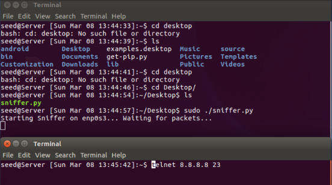 | 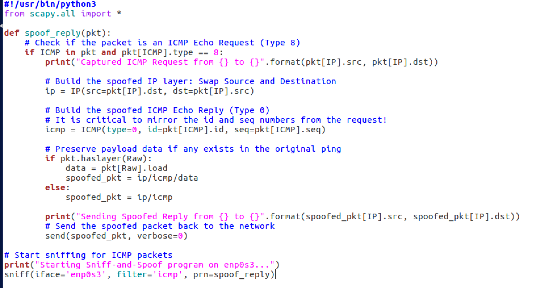 | 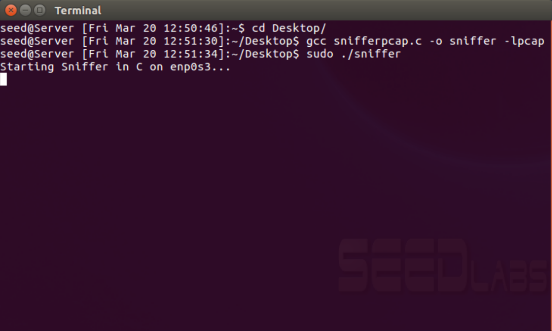 |
| 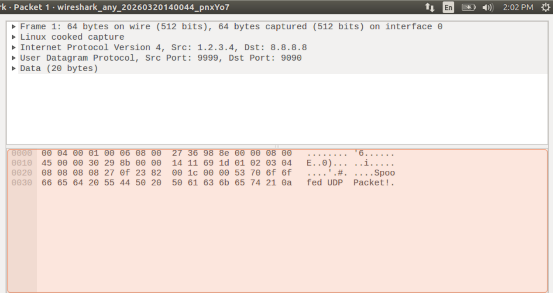 | 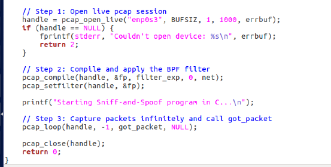 |  |

View all screenshots (75 images)

| | | |
|---|---|---|
| 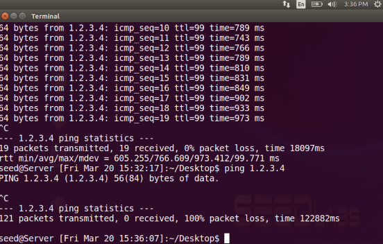 | 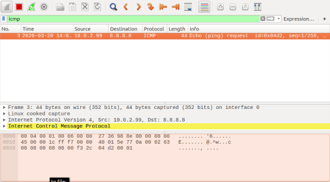 | 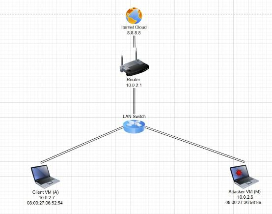 |
| 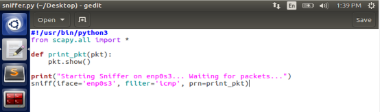 | 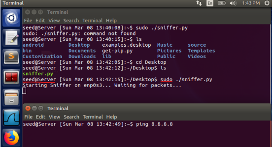 | 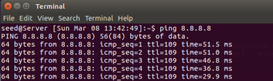 |
| 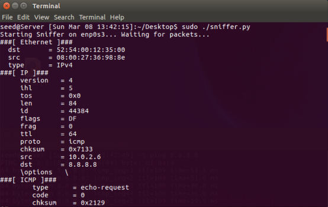 | 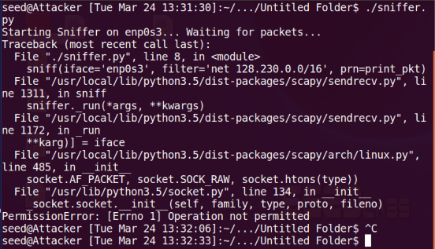 | 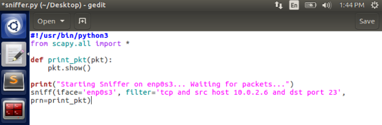 |
|  | 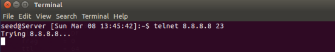 | 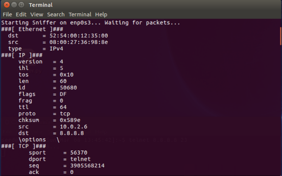 |
| 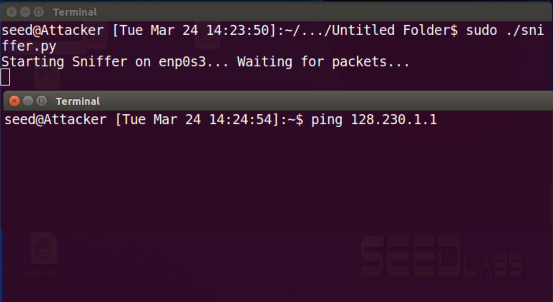 | 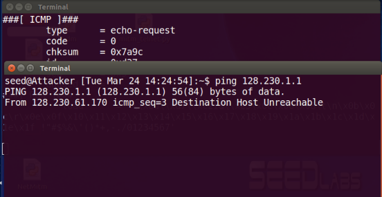 | 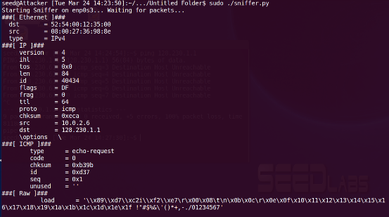 |
| 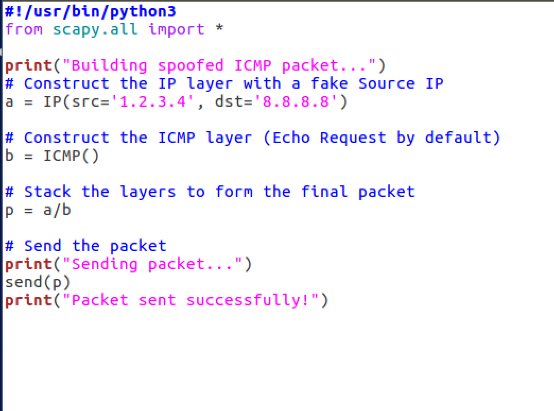 | 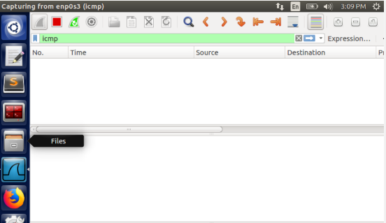 | 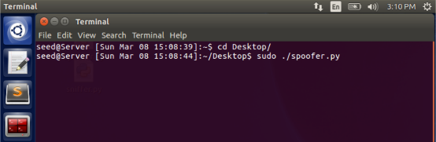 |
| 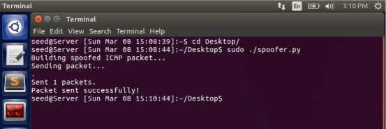 | 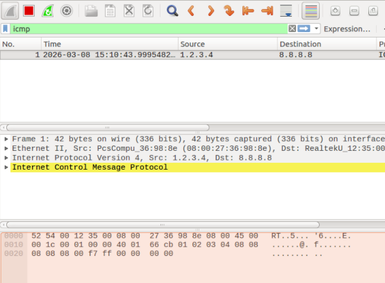 | 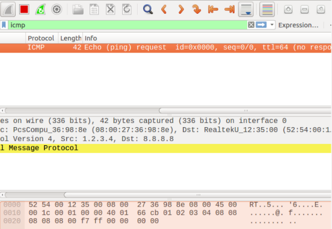 |
| 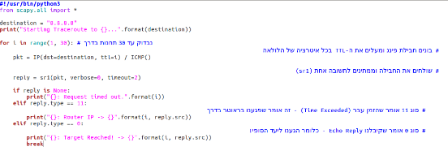 | 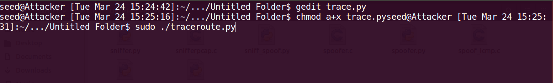 | 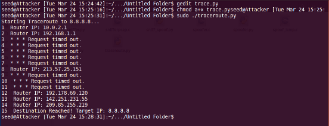 |
|  | 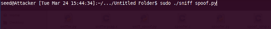 | 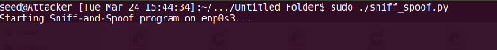 |
| 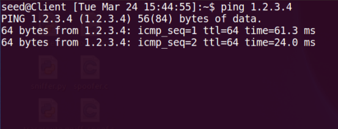 | 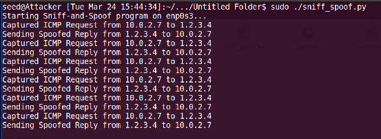 | 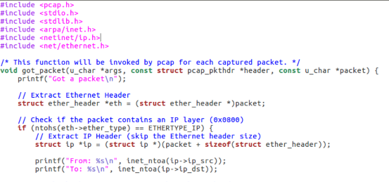 |
| 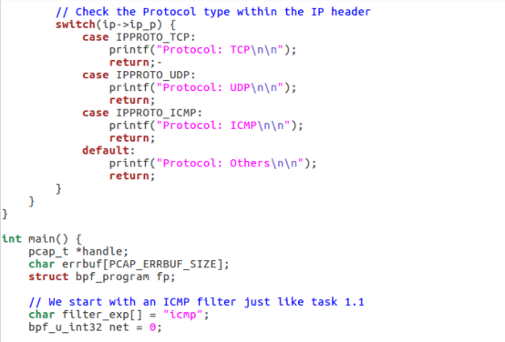 | 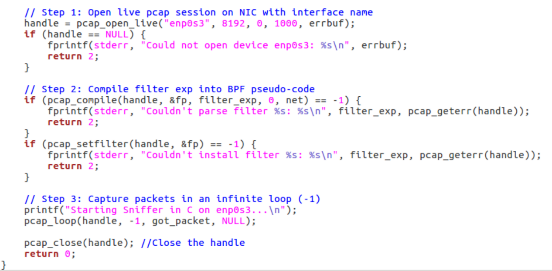 | 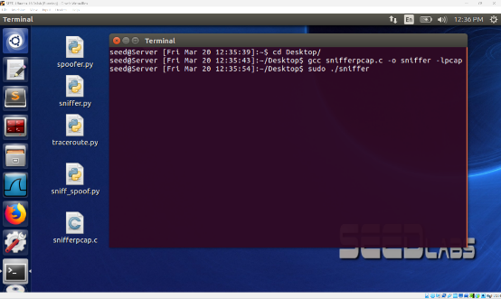 |
| 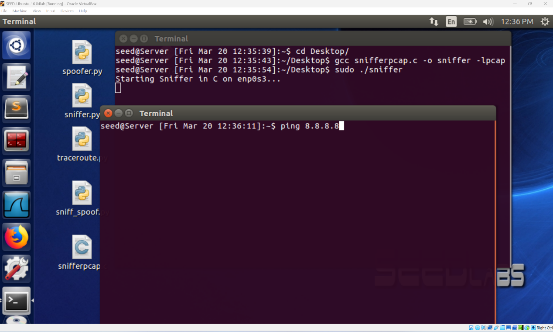 | 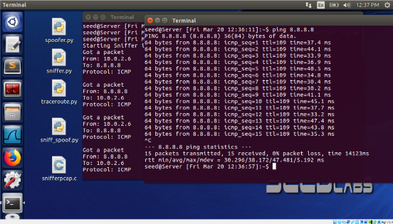 | 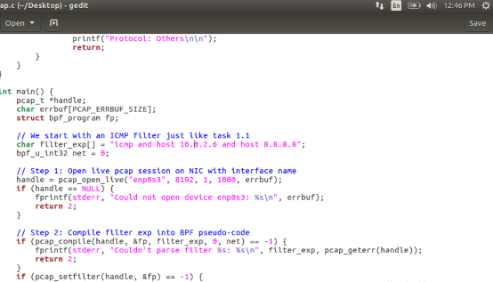 |
| 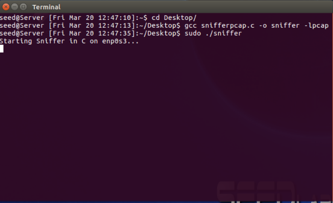 | 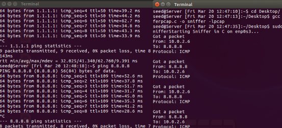 | 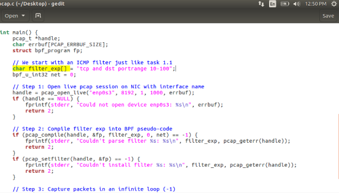 |
|  | 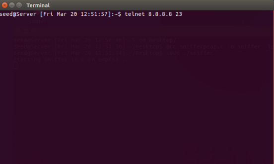 | 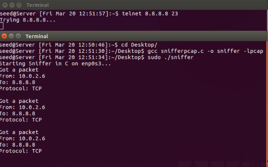 |
| 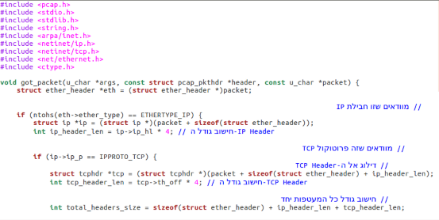 | 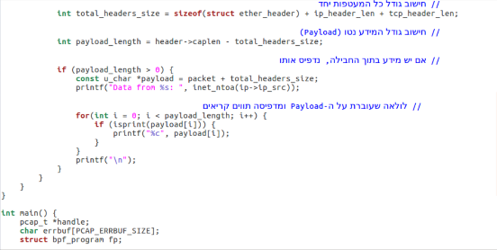 | 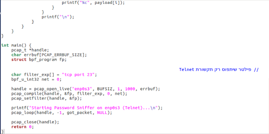 |
| 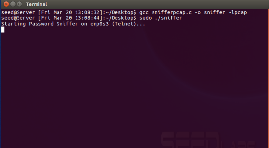 | 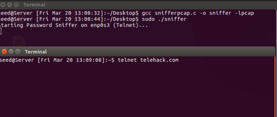 | 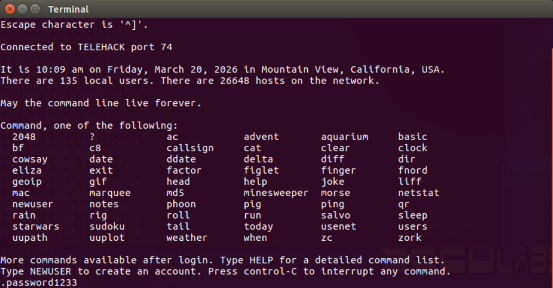 |
|  |  |  |
|  |  |  |
|  |  |  |
|  |  |  |
|  |  |  |
|  |  |  |
|  |  |  |
|  |  |  |
|  |  |  |

---

[Back to all labs](../README.md)
