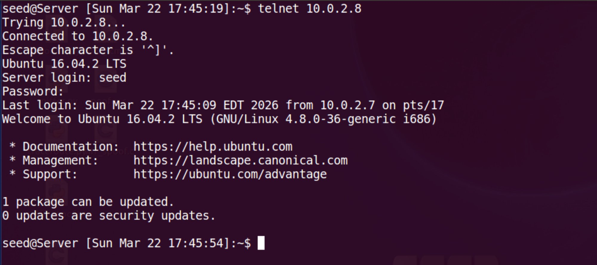
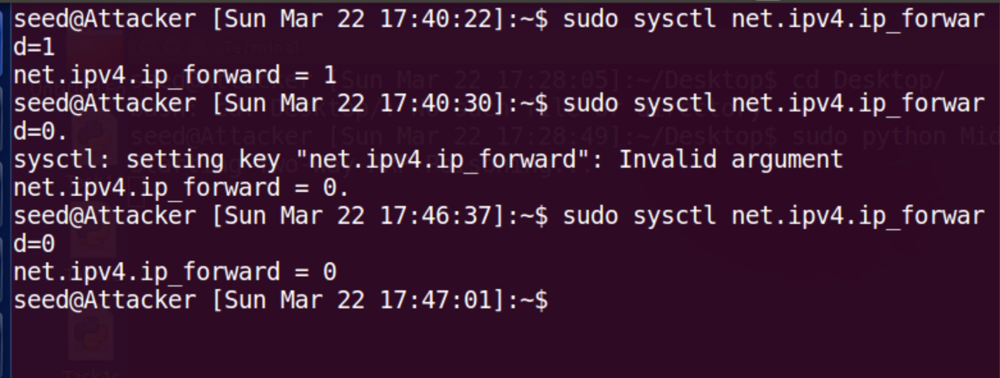
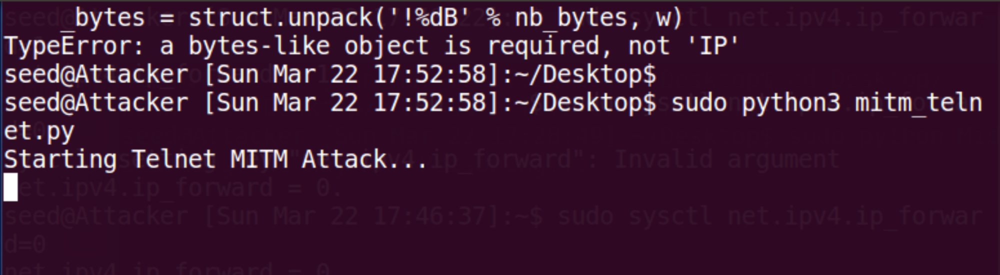

# Lab 1: ARP Cache Poisoning Attack

**SEED Labs : Network Security Laboratory**
**Team:** Bar Sberro · Shalev Cohen · Noam Hadad
**Date:** March 23, 2026

[← Lab 0](../lab-0/README.md) | [Index](../README.md) | [Lab 2 →](../lab-2/README.md)

---

## Contents

1. [Network Topology](#network-topology)
2. [Task 1 : ARP Cache Poisoning](#task-1-arp-cache-poisoning)
   * [Task 1A : via ARP Request](#task-1a-arp-cache-poisoning-via-arp-request-op1)
   * [Task 1B : via ARP Reply](#task-1b-arp-cache-poisoning-via-arp-reply-op2)
   * [Task 1C : via Gratuitous ARP](#task-1c-arp-cache-poisoning-via-gratuitous-arp)
3. [Task 2 : MITM Attack on Telnet](#task-2-mitm-attack-on-telnet-using-arp-cache-poisoning)
4. [Task 3 : MITM Attack on Netcat](#task-3-mitm-attack-on-netcat-using-arp-cache-poisoning)
5. [Lab Summary](#lab-summary)

---

## Network Topology

All three machines share the same subnet (10.0.2.0/24) and are connected via a virtual switch.

| Role | Hostname | IP | MAC |
|---|---|---|---|
| Client A (victim) | User VM | 10.0.2.7 | 08:00:27:xx:xx:xx |
| Server B (victim) | Server VM | 10.0.2.8 | 08:00:27:29:a5:7d |
| Attacker M | Attacker VM | 10.0.2.6 | 08:00:27:36:98:8e |


---

## Task 1: ARP Cache Poisoning

### Background

ARP (Address Resolution Protocol) is a stateless Layer 2 protocol that maps IP addresses to MAC addresses. It has no authentication: any host can broadcast a fabricated IP-to-MAC mapping, and other hosts will accept and cache it without verification. This flaw enables ARP Cache Poisoning attacks.

**Goal:** Poison the ARP cache of Client A so that the IP 10.0.2.8 (Server B) maps to the Attacker's MAC address (`08:00:27:36:98:8e`) instead of Server B's real MAC (`08:00:27:29:a5:7d`).

**Verification:** After each sub-task, running `arp -n` on Client A must show `10.0.2.8 --> 08:00:27:36:98:8e`.

---

### Task 1A: ARP Cache Poisoning via ARP Request (op=1)

A spoofed ARP Request (`op=1`) is sent from Attacker M to Client A, claiming that Server B's IP (`10.0.2.8`) resolves to the Attacker's MAC address.


Before sending the packet, Client A's ARP cache was verified. No entry for `10.0.2.8` existed:


The script was executed on the Attacker with `sudo`:


After sending, Client A's ARP cache was checked again:


**Result:** Poisoning successful. Even without a prior ARP entry, an unsolicited ARP Request with a spoofed source IP/MAC is accepted and cached by the victim. ARP has no authentication — the receiving host accepts any ARP packet and updates its cache unconditionally.

---

### Task 1B: ARP Cache Poisoning via ARP Reply (op=2)

An ARP Reply (`op=2`) explicitly specifies both sender and destination IP/MAC pairs. It is sent directly to Client A, claiming Server B's IP is at the Attacker's MAC.


Client A's ARP cache was cleared first. The single screenshot below captures both states on the same terminal: the upper `arp : n` (13:34:10) shows the pre attack cache (no `10.0.2.8` entry), and the lower `arp : n` (13:34:19) shows the post attack cache (`10.0.2.8` mapped to the Attacker MAC `08:00:27:36:98:8e`):


The Reply was sent from the Attacker between the two `arp : n` calls:


**Key observation:** The OS will reject a spoofed ARP Reply if the ARP cache is completely empty. For the Reply attack to succeed, there must be a prior communication attempt by the victim (e.g., a Ping), which creates an `(incomplete)` entry. Once the system is actively waiting for a reply, it blindly trusts the spoofed response without verifying the sender's identity.

---

### Task 1C: ARP Cache Poisoning via Gratuitous ARP

A Gratuitous ARP is a special ARP Request where the source and destination IP are identical, and the Ethernet destination is the broadcast address (`ff:ff:ff:ff:ff:ff`). It is used legitimately to announce IP changes to all hosts simultaneously. Here it is used maliciously.


Client A's cache was cleared before the attack (`10.0.2.8 = incomplete`):


The Gratuitous ARP was sent:


After the attack:


**Key observation:** Gratuitous ARP is particularly dangerous because a single broadcast packet simultaneously poisons all hosts on the subnet — no targeting is required. All three poisoning methods (Request, Reply, Gratuitous) exploit the same fundamental flaw: ARP accepts any IP-to-MAC mapping without source authentication.

---

## Task 2: MITM Attack on Telnet using ARP Cache Poisoning

### Background

A Man-in-the-Middle (MITM) attack using ARP poisoning intercepts all Layer 2 traffic between two hosts. By continuously poisoning both victims' ARP caches, the attacker positions itself between them. With IP forwarding enabled, the attack is transparent to both victims. With forwarding disabled, traffic is dropped entirely.

**Task steps:**
1. Continuous two-way ARP poisoning (both A and B redirect to M)
2. Test with forwarding=0: verify 100% packet loss
3. Enable forwarding=1: verify transparent forwarding
4. Telnet MITM: replace every alphabetic character with `Z`

---

### Step 1: Two-Way ARP Cache Poisoning

The MITM script sends ARP Replies to both Client A and Server B every 2 seconds, continuously maintaining poisoned ARP caches on both victims.


Client A's ARP table before the attack (`10.0.2.8 = incomplete`):


Server B's ARP table before and after poisoning:


Midm script running:


---

### Step 2: Ping Test with IP Forwarding Disabled (forward=0)

With `ip_forward=0`, packets arriving at Attacker M are dropped. Client A pings Server B and receives no responses.


Wireshark on the Attacker confirms packets arriving at M but never reaching B:


![Wireshark packet detail: "[No response seen]" confirms packets are trapped at M](assets/screenshot-20.png)

---

### Step 3: IP Forwarding Enabled (forward=1)

With `ip_forward=1`, M forwards packets to their destinations. Both victims communicate normally while all traffic passes through M.


Wireshark on M shows ICMP request/reply pairs passing through:


> [!NOTE]
> ICMP Redirect messages from the Attacker machine (10.0.2.6) are automatically generated by the Linux kernel because it is routing traffic back out the same interface it arrived on. The continuous ARP poisoning overrides these redirect attempts and maintains the MITM position. (This same mechanism is weaponized as an attack in Lab 2, Task 2.)

---

### Step 4: Telnet MITM — Replace All Alphabetic Characters with Z

The `mitm_telnet.py` script intercepts TCP packets from Client A to Server B and replaces every alphabetic character with `"Z"`. Packets flowing from B to A are forwarded unchanged.


A Telnet session was established from Client A to Server B while forwarding was enabled:


After login, `ip_forward` was set to `0` and the MITM script was launched:




All alphabetic characters typed on Client A appear as `Z` at the Server. Numbers and special characters pass through unchanged:





Wireshark confirms Telnet (TCP port 23) traffic being intercepted at M:


> [!TIP]
> **Problem solved:** An initial `TypeError` ("bytes like object required, not IP") was caused by passing an IP object directly to the payload builder. Fixed by using `IP(bytes(pkt[IP]))` to create a proper bytes copy before modification.

---

## Task 3: MITM Attack on Netcat using ARP Cache Poisoning

### Background

This task mirrors Task 2 but targets Netcat (`nc`) on TCP port 9090. Unlike Telnet where individual keystrokes are intercepted, Netcat sends full lines of text. The objective is to replace every occurrence of the name `"Adrian"` (6 characters) with `"AAAAAA"` (6 A's).

**Critical constraint:** Payload length must be preserved exactly. Changing the payload length corrupts TCP sequence numbers and breaks the connection.

---

### Step 1: Two-Way Poisoning with Updated Midm Script

For this task, the Midm script was updated to use ARP Requests (`op=1`) instead of Replies, which proved more stable for maintaining continuous cache poisoning:


ARP tables verified before the attack:


Running the updated Midm:


Poisoning confirmed on both victims:


---

### NetMitm Script

The NetMitm script intercepts TCP port 9090 traffic, replaces `"Adrian"` (and case/typo variants) with `"AAAAAA"` in packets flowing from Server to Client, and forwards all other packets unchanged.


---

### Step 2: Launch the Netcat MITM

IP forwarding set to 0, NetMitm launched:


Client A runs `nc -l 9090` (listener); Server B connects with `nc 10.0.2.7 9090`. Messages sent from Server B pass through Attacker M to Client A:


Full session on Server B:


Full session on Client A:


**Result:** All occurrences of `"Adrian"` were replaced with `"AAAAAA"` in transit while all other content (names, punctuation, numbers) passed through unchanged.

> [!TIP]
> **Stability improvement:** The initial ARP Reply based Midm was occasionally unreliable. Switching to ARP Request based poisoning (`op=1`) significantly improved stability. The `"tcp port 9090"` filter was critical to prevent the script from capturing and re processing its own injected packets.

---

## Lab Summary

### Key Findings

| Attack | Method | Result |
|---|---|---|
| ARP Poisoning | ARP Request (op=1) | Accepted by target without prior entry |
| ARP Poisoning | ARP Reply (op=2) | Requires `(incomplete)` entry to succeed |
| ARP Poisoning | Gratuitous ARP | Simultaneously poisons all LAN hosts |
| MITM | Two-way continuous poisoning | Transparent with forwarding=1 |
| Telnet MITM | Payload byte replacement | All alpha chars replaced with Z |
| Netcat MITM | Length-preserving substitution | "Adrian" replaced with "AAAAAA" |

### Core Lessons

- **ARP has no authentication.** All three poisoning methods succeed because any host can broadcast a fabricated IP-to-MAC mapping.
- **MITM is transparent.** With IP forwarding enabled, both victims communicate normally with no indication of interception.
- **Unencrypted protocols are critically vulnerable.** Telnet and Netcat transmit plaintext — SSH or TLS prevents payload reading and modification even when MITM positioning succeeds.
- **Continuous poisoning is required.** ARP cache entries expire (typically within minutes); the attacker must continuously resend poisoned packets.
- **Layer 2 attacks are LAN-scoped.** ARP poisoning cannot cross routers — only hosts on the same Layer 2 segment are reachable.

### Defenses

- **Dynamic ARP Inspection (DAI)** on managed switches validates ARP packets against a trusted DHCP snooping table.
- **Static ARP entries** for critical hosts prevent cache updates (impractical at scale).
- **Encrypted protocols** (SSH instead of Telnet, HTTPS instead of HTTP) prevent payload reading and modification even when MITM positioning succeeds.
- **Network IDS tools** such as `arpwatch` or XArp detect abnormal ARP activity patterns.

### Beyond Lab Requirements

During preparation, the `arpspoof` tool (part of the `dsniff` suite) was evaluated alongside the manual Scapy scripts. Unlike the custom scripts written for this lab, `arpspoof` automates continuous ARP poisoning with a single command:

```bash
sudo arpspoof -i eth0 -t 10.0.2.7 10.0.2.8   # Poison A
sudo arpspoof -i eth0 -t 10.0.2.8 10.0.2.7   # Poison B
```

Combined with `ettercap` or Wireshark, a complete passive MITM can be set up in seconds. This highlights how low the barrier is for these attacks in practice, reinforcing the importance of encrypted protocols and Dynamic ARP Inspection as primary defenses.
