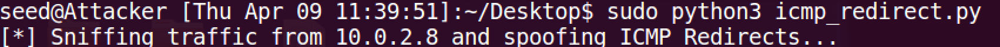
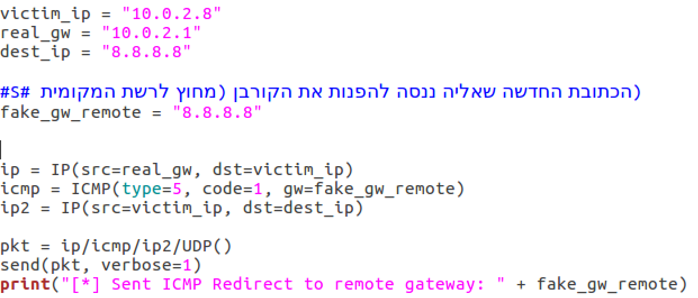

# Lab 2 — IP / ICMP Attacks

**Course:** SEED Labs — Network Security  
**Team:** Bar Sberro · Shalev Cohen · Noam Hadad  
**Report:** [Download Full Report (Word)](./Lab-2-Report.docx)

---

## Overview

This lab targets the IPv4 layer itself — exploiting IP Fragmentation, ICMP control messages, and routing mechanisms.  
Attacks range from crashing hosts via malformed packets to hijacking routing decisions and exhausting kernel memory.

**Network topology:**

| Role | IP |
|---|---|
| Client | 10.0.2.7 |
| Attacker | 10.0.2.6 |
| Server | 10.0.2.8 |
| Internal subnet (Lab 3c) | 192.168.60.0/24 |

---

## Task 1a — IP Fragmentation

**Background:** IPv4 allows large packets to be split into fragments. Each fragment carries:
- **Identification** (same across all fragments of one packet)
- **Flags** (MF = More Fragments, DF = Don't Fragment)
- **Fragment Offset** (position in units of 8 bytes)

**Goal:** Send a 96-byte UDP message split across 3 fragments (32 bytes each) to a UDP server on port 9090.

**Implementation (Python/Scapy):**
- Fragment 1: offset=0, flags=MF (More Fragments)
- Fragment 2: offset=5 (40 bytes), flags=MF
- Fragment 3: offset=10 (80 bytes), flags=0 (last fragment)

Server (Netcat `nc -lu 9090`) successfully received and reassembled the full 96-byte payload. ✅

**Challenge solved:** Scapy does not automatically recompute UDP Checksum after manual fragmentation — set `pkt[UDP].cheksum = 0` to force recalculation.


---

## Task 1b — Overlapping IP Fragments

**Background:** When two fragments cover the same byte range (overlapping offsets), the OS must decide which data wins.  
Linux uses **"Favor Lower Offset"**: earlier fragments take priority over later ones in the overlapping range.  
This behavior was historically exploited in the **Teardrop attack** to crash vulnerable kernels.

**Experiments:**

### Partial Overlap
- Fragment A: 32 bytes of `'A'` at offset 0 (with UDP header)
- Fragment B: 24 bytes of `'B'` at offset 4 (offset=32 bytes, overlapping last 8 bytes of A)

**Result:** Server received 32 `'A'` followed by 24 `'B'` (Linux kept `'A'` in the overlap zone, then appended the non-overlapping `'B'` bytes). ✅

### Enclosed Overlap
- Fragment A: 64 bytes of `'A'` at offset 0
- Fragment B: 16 bytes of `'B'` at offset 2 (fully inside A's range)

**Result:** Server received only `'A'` bytes — the enclosed `'B'` fragment was completely ignored. ✅

**Security implication:** IDS/firewall evasion — an attacker can split a malicious payload across overlapping fragments where the first innocent-looking fragment passes inspection, and the malicious second fragment overwrites it on the end host (or vice versa, depending on OS reassembly policy).


---

## Task 1c — Ping of Death

**Background:** IPv4 Total Length field is 16 bits → maximum packet size is 65,535 bytes.  
The "Ping of Death" abuses IP Fragmentation to send a reassembled packet **larger than 65,535 bytes**, causing a buffer overflow on vulnerable systems.

**Implementation:**
- Fragment 1: offset=0, payload = 8 bytes, MF=1
- Fragment 2: offset=8191 (65,528 bytes), payload = 100 bytes, MF=0
- Reassembled total: 65,528 + 100 = **65,628 bytes** (exceeds the 65,535 limit)

**Result:** Modern Linux (Ubuntu 16.04) detected and dropped the oversized packet — a Sanity Check in the IP reassembly code.  
Server returned ICMP Type 11 (Time Exceeded) after timeout.  
Wireshark confirmed: Fragment Offset 65,528, Flags 0x00, 100-byte payload — packet construction was correct. ✅

**Note:** While modern kernels are protected, this attack was responsible for crashing Windows 95/NT and early Linux kernels in the late 1990s.


---

## Task 1d — Fragment Flood DoS

**Background:** The kernel maintains a **Reassembly Queue** — a buffer of incomplete fragment sets waiting for their missing pieces.  
Each incomplete set is held for ~30 seconds before timing out.  
Flooding the queue with fragments that never complete exhausts kernel memory → **Denial of Service**.

**Attack:** Send a continuous stream of UDP fragments with `MF=1` (More Fragments) but never send the final fragment.  
Each unique `ID` field creates a new incomplete entry in the queue.

### Implementation A — Python/Scapy
Sent fragments rapidly from Attacker (10.0.2.6) to Server (10.0.2.8).  
Monitored: `watch -n 1 'netstat -s | grep -i reasm'`

Result: 497 reassembly failures observed. Client ping showed 0% packet loss initially, rising as the queue filled. ✅


### Implementation B — C / Raw Sockets (5 Terminals)
Rewrote the attack in C using Raw Sockets for higher throughput than Python/Scapy can achieve.  
Launched 5 parallel terminal instances simultaneously.

**Evidence:**
- `netstat -s`: 178 packet reassembles failed across 5 terminals / 178 seconds
- Client Ping (MTU 8000): packet loss rose from **50% to 75%** under attack
- After stopping attack: packet loss returned to 0%

**Key difference between Python and C implementations:**  
Python/Scapy: easier to write, lower packet rate (Python overhead)  
C/Raw Sockets: significantly higher packet rate, directly fills reassembly queue faster


---

## Task 2 — ICMP Redirect Attack

**Background:** ICMP Redirect (Type 5) is a message a router sends to a host when it knows a better route.  
An attacker on the same LAN can forge ICMP Redirects to manipulate a victim's routing cache.

**Goal:** Make Server (10.0.2.8) route traffic for 8.8.8.8 through Attacker (10.0.2.6) instead of the real gateway (10.0.2.1).

**Implementation:**
Attacker sniffs for packets from Server, then sends forged ICMP Redirect (Type 5, Code 1 — Redirect Host):
- Source IP: 10.0.2.1 (spoofed as the real gateway)
- Gateway (gw): 10.0.2.6 (Attacker's IP as the new next-hop)
- Encapsulates the original IP header to pass Linux sanity checks

**Result:**
```
ip route get 8.8.8.8
# Shows: via 10.0.2.6 <redirected>
```
Server's routing cache updated — traffic to 8.8.8.8 now routed through Attacker. ✅

**Extended questions answered:**

**Q: Can you redirect traffic to a remote machine (8.8.8.8) as the new gateway?**  
No — Linux performs a Sanity Check: the redirected gateway must be on the same subnet as the interface. 8.8.8.8 is not in 10.0.2.0/24 so the redirect is silently ignored.

**Q: Can you redirect to a non-existent local machine (10.0.2.99)?**  
The redirect is accepted into the routing cache, but packets are then dropped because ARP cannot resolve 10.0.2.99's MAC address → the attack functions as a DoS rather than MITM.


---

## Tasks 3a/3b — Network and Routing Setup (Multi-Subnet)

Configured the Attacker VM as a **Layer 3 router** between two subnets:
- NAT subnet: 10.0.2.0/24 (external)
- Internal subnet: 192.168.60.0/24

Steps:
1. Assigned second IP to Attacker: `enp0s8 = 192.168.60.1`
2. Assigned Client second IP: `enp0s3 = 192.168.60.5`
3. Enabled IP Forwarding on Attacker: `sysctl net.ipv4.ip_forward=1`
4. Added static routes on both Client and Server: `ip route add <subnet> via <next-hop>`

**Result:** `ping 192.168.60.5` from Attacker: 4 packets, 0% loss. ✅


---

## Task 3c — Reverse Path Filtering (RPF)

**Background:** RPF is a kernel mechanism that blocks IP Spoofing by asking: "If I were to reply to this packet's source IP, would it go back out the same interface?"  
If not, the packet is dropped.

### Strict RPF (rp_filter=1)
Attacker sends ICMP to internal subnet (192.168.60.5) with a spoofed source IP from the NAT subnet (10.0.2.99).  
Wireshark showed: packet arrives at `enp0s3`, Strict RPF drops it because the source 10.0.2.99 would be routed back out `enp0s3` — but it arrived on `enp0s3` from the "wrong direction".

**Bypass via IP-in-IP Encapsulation:** Wrapped the spoofed packet inside a legitimate outer IP header. The encapsulated inner packet bypasses RPF because the outer header is valid. (Requires `ipip` tunnel module.)

### Loose RPF (rp_filter=2)
Loose RPF only checks: "Does ANY route exist for the source IP?"  
Set `rp_filter=2` and added a route for the spoofed subnet: `ip route add 192.168.60.0/24 via 10.0.2.7`  
With this route present, Loose RPF accepted packets with spoofed source IP 192.168.60.99. ✅

**Conclusion:** Strict RPF is a strong defense against LAN-local spoofing. Loose RPF adds flexibility for multi-homed hosts but is far weaker. Neither protects against IP-in-IP encapsulation.


---

## Beyond Requirements

- **5-terminal parallel DoS in C:** Demonstrated measurably higher attack effectiveness than Python (75% packet loss confirmed with `netstat` and live ping monitoring)
- **IP-in-IP encapsulation bypass:** Researched and documented how encapsulation defeats Strict RPF — a technique used in real-world evasion scenarios
- **Hardware offloading note:** Documented how NIC-level LRO/GRO (Large/Generic Receive Offload) can interfere with fragment-level Wireshark captures in virtualized environments

---

## Screenshots

<details>
<summary>View all screenshots (55 images)</summary>

| | | |
|---|---|---|
|  |  |  |
|  |  |  |
|  |  |  |
|  |  |  |
|  |  |  |
|  |  |  |
|  |  |  |
|  |  |  |
|  |  |  |
|  |  |  |
|  |  |  |
|  |  |  |
|  |  |  |
|  |  |  |
|  |  |  |
|  |  |  |
|  |  |  |
|  |  |  |
|  | | |

</details>

---

[Back to all labs](../README.md)
