# Lab 2: IP / ICMP Attacks

**SEED Labs — Network Security Laboratory**
**Team:** Bar Sberro (314683665) · Shalev Cohen (314745456) · Noam Hadad (3147014118)

---

## Network Topology

Tasks 1 and 2 use a two-machine layout (Attacker + Server) on the same subnet. Task 3 extends this to include a Router VM bridging two separate subnets.

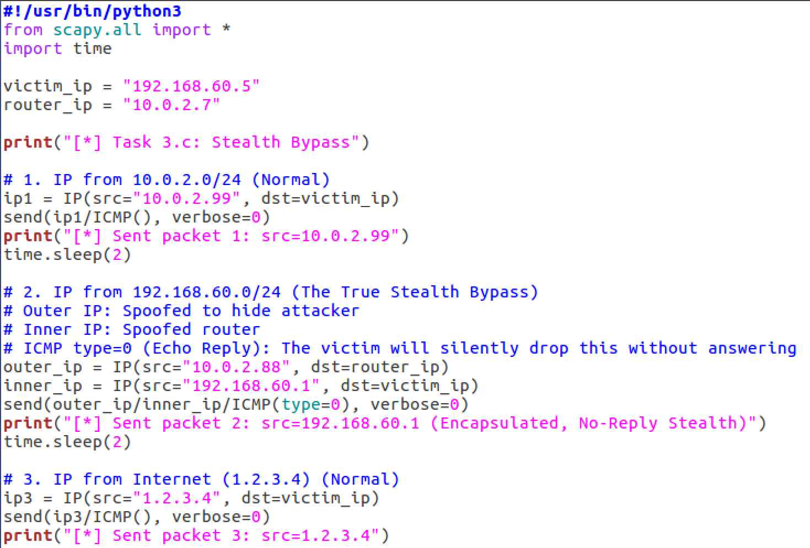

---

## Task 1.a: IP Fragmentation

### Background

IP fragmentation allows large packets to be split into smaller fragments for transmission across networks with smaller MTUs. Each fragment carries:
- **Identification field:** a shared ID tying all fragments of the same original packet together
- **Flags field:** the More Fragments (MF) bit signals whether more fragments follow
- **Fragment Offset field:** the byte position of this fragment's payload within the original packet (units: 8-byte blocks)

### Objective

Manually craft a UDP datagram split into exactly 3 fragments, each carrying 32 bytes of payload (96 bytes total), and deliver the reassembled datagram to a `netcat` UDP server on port 9090.

### Execution

A `netcat` UDP server was started on the Server VM:

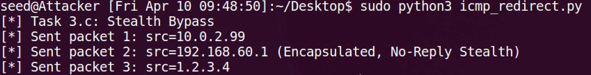

The fragmentation script was written in Python using Scapy. The UDP checksum was set to 0 to prevent Scapy from recalculating it (which would be invalid once the header is split). Fragment offsets are expressed in units of 8 bytes: Fragment 2 at offset 5 (40 bytes), Fragment 3 at offset 10 (80 bytes).

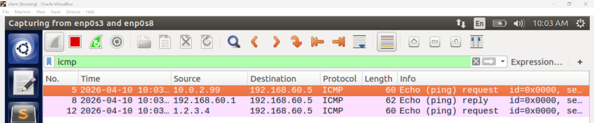

Wireshark was used to verify fragment transmission. The fragments appeared as separate packets, each with the same Identification value, the correct More Fragments flag, and the expected offset values:

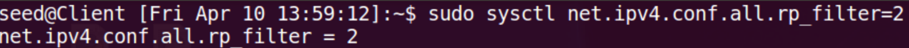

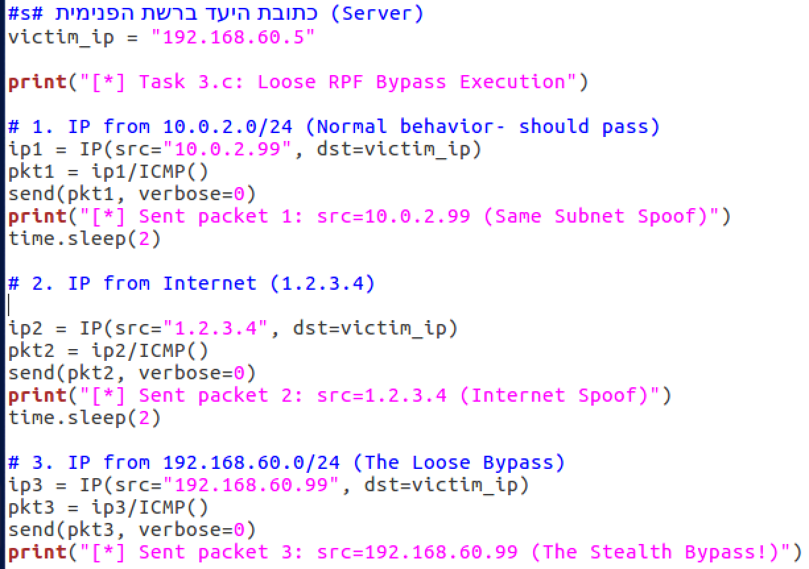

The netcat server on the Server VM received the reassembled 96-byte payload:

The kernel correctly identified all three fragments as belonging to the same datagram (matching ID), reassembled them in offset order, and delivered the complete 96-byte payload to the netcat listener.

### Summary

**What was learned?** Fragment offset arithmetic is critical. Scapy's `frag` parameter takes the offset in units of 8 bytes, not raw bytes. The first fragment must have offset 0 and `flags=1` (MF set); intermediate fragments have non-zero offsets and `flags=1`; the final fragment has `flags=0`. The UDP header lives entirely in the first fragment and the kernel reconstructs the full UDP datagram before delivering to the application.

> **Problem encountered:** Scapy auto-recalculates UDP checksums, which invalidates the checksum once the UDP header is split from part of its payload. Setting `pkt[UDP].checksum = 0` before sending instructs the OS to skip checksum validation on receipt, allowing the experiment to proceed correctly.

---

## Task 1.b: IP Fragments with Overlapping Contents

### Background

When two fragments cover the same byte range (overlapping offsets), the kernel must decide which fragment's bytes take precedence. Historically, ambiguous overlap handling caused the **Teardrop attack** — specially crafted overlapping fragments caused kernel buffer overflows and system crashes. Modern Linux kernels enforce a **Favor Lower Offset** policy: data from the fragment with the lower offset always wins, regardless of arrival order.

### Objective

Test two overlap scenarios against Ubuntu's kernel:
1. **Partial Overlap:** Fragment B partially overlaps Fragment A
2. **Enclosed Overlap:** Fragment B is entirely contained within Fragment A's byte range

### Scenario 1: Partial Overlap

Fragment A carries 32 bytes of `'A'` at offset 0. Fragment B carries 32 bytes of `'B'` starting at offset 4 (byte 32), overlapping the last 8 bytes of Fragment A's range.

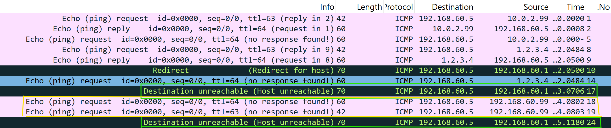

The Server received the reassembled payload:

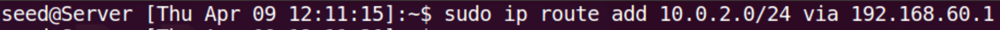

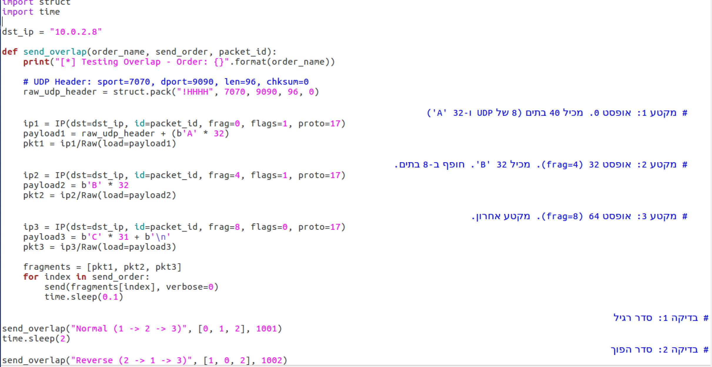

**Result:** Linux preserved Fragment A's data in the overlapping region and truncated Fragment B by 8 bytes. The final output was `32×'A' + 24×'B'` — identical regardless of which fragment arrived first.

### Scenario 2: Enclosed Overlap

Fragment A carries 64 bytes of `'A'` at offset 0. Fragment B carries 16 bytes of `'B'` at offset 2 (byte 16) — entirely inside Fragment A's range. Fragment C carries 32 bytes of `'C'` at offset 8 (byte 64), immediately after Fragment A.

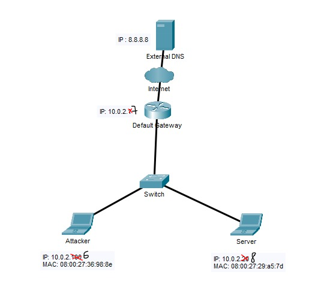

The Server received the reassembled payload:

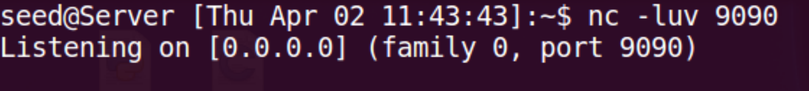

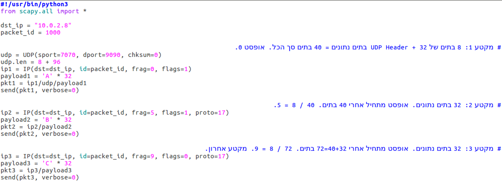

**Result:** Fragment B was completely discarded. The kernel applied Favor Lower Offset strictly: since Fragment A (offset=0) already covered the entire byte range that Fragment B occupied, Fragment B's data was silently dropped regardless of arrival order.

### Summary

**What was learned?** Linux's reassembly policy is deterministic and arrival-order-independent:
- **Partial overlap:** The lower-offset fragment's bytes always prevail. The higher-offset fragment is trimmed.
- **Enclosed overlap:** The enclosing fragment's data completely replaces the enclosed fragment's data.

This makes the Teardrop attack (which relied on kernel panics from overlapping fragments) ineffective on modern systems. The kernel simply applies its conflict resolution policy and drops conflicting data safely.

> **Problem solved:** Scapy's automatic UDP header recalculation corrupted checksums when fragments were crafted manually. This was resolved by using Python's `struct` module to build a raw UDP header with checksum=0 and embedding it directly into the first fragment's payload, preventing Scapy from modifying the header bytes.

---

## Task 1.c: Ping of Death

### Background

The maximum legal IPv4 packet size is 65,535 bytes (the IP Total Length field is 16 bits). The **Ping of Death** attack exploits IP fragmentation by sending fragments that, when reassembled, would produce a packet exceeding this maximum. On historical systems, the kernel's reassembly buffer overflowed, causing crashes. Modern kernels detect and discard the oversized reconstruction attempt.

### Objective

Send two fragments: Fragment 1 at offset 0 with MF=1, Fragment 2 at offset 65,528 (byte position 65,528×8 = incorrect — offset 65,528 in units that produce a reconstructed size of 65,628 bytes) with 100 bytes of payload, producing a total reconstructed size of 65,628 bytes — exceeding the 65,535 byte maximum.

### Execution

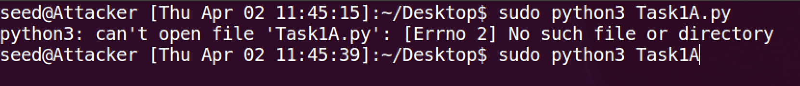

A netcat UDP server was running on the Server VM (`nc -luv 9090`). The attack script was executed from the Attacker:

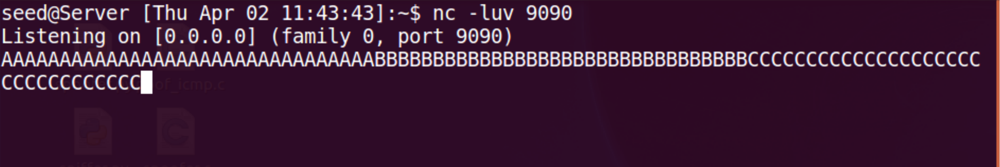

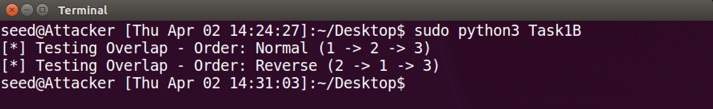

Wireshark captured the oversized fragment on the Server:

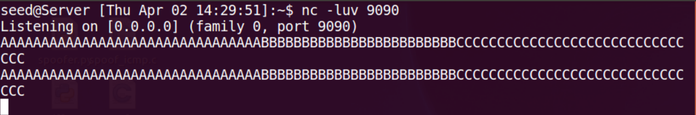

The Server responded with ICMP Type 11 (Time-to-Live Exceeded) rather than crashing:

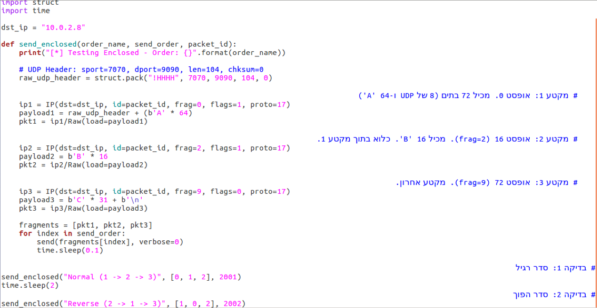

After approximately 30 seconds, the kernel's reassembly timer expired. The kernel reported the dropped fragments via `netstat`:

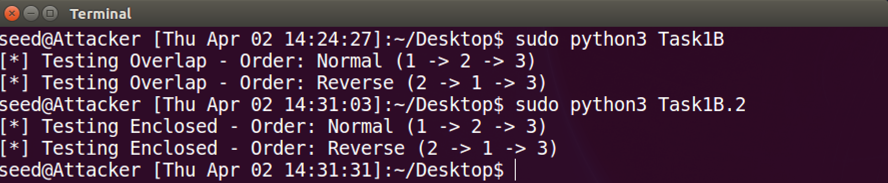

**Analysis:** Modern Ubuntu kernels handle this gracefully. When the huge gap between Fragment 1 (offset=0) and Fragment 2 (offset=65,528) is detected, the kernel holds the fragments in its reassembly queue until the timeout fires, then discards them and increments the failure counter. No buffer overflow occurs because the kernel validates the total reassembled size before allocating a full buffer.

### Summary

**What was learned?** The Ping of Death is a historical attack that exploited unvalidated buffer allocation in early IP stacks. Modern kernels enforce the 65,535-byte limit as a sanity check during reassembly queue management. The attack still generates observable side effects (ICMP Time Exceeded, reassembly failure counters) that confirm the fragments were received — the protection is in the kernel's refusal to allocate an oversize buffer, not in network-level blocking.

---

## Task 1.d: Fragment Flood DoS

### Background

When a router or host receives IP fragments with MF=1, it must hold them in a **Reassembly Queue** in kernel memory while waiting for the remaining fragments. If the final fragment never arrives, the kernel eventually times out and discards the entry. A **Fragment Flood** attack exploits this by sending millions of first fragments (MF=1) with different IDs, each one forcing the kernel to open a new reassembly queue entry. When these entries accumulate faster than they time out, the kernel's reassembly buffer is exhausted and legitimate fragmented traffic is dropped.

### Comparison: Python vs C Attack Speed

**Experiment A — Python/Scapy flood:**

A Scapy-based Python script sent fragmented UDP packets with MF=1 and random IDs in an infinite loop.

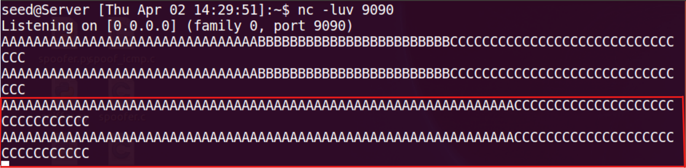

The Server's reassembly statistics were monitored with `watch -n 1 'netstat -s | grep -i reasm'`:

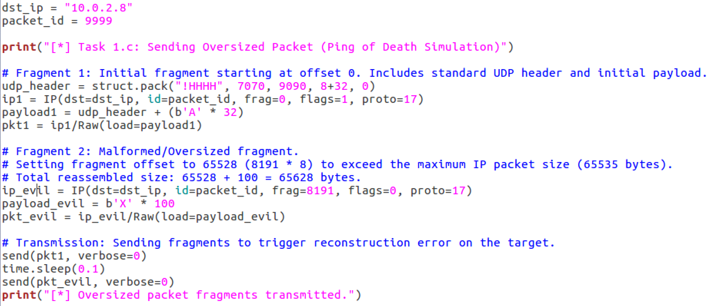

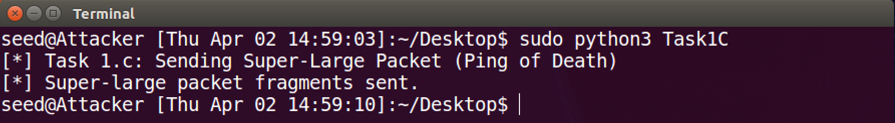

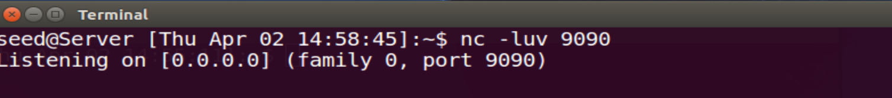

**Conclusion:** Python/Scapy is too slow. The kernel's reassembly timeout clears entries faster than Python can fill them. The DoS failed.

---

**Experiment B — C/Raw Sockets flood (5 parallel terminals):**

A C program using Raw Sockets was written. It builds IP headers directly in memory, sets random fragment IDs, and sends packets at maximum kernel throughput. Five instances were run simultaneously from separate terminals.

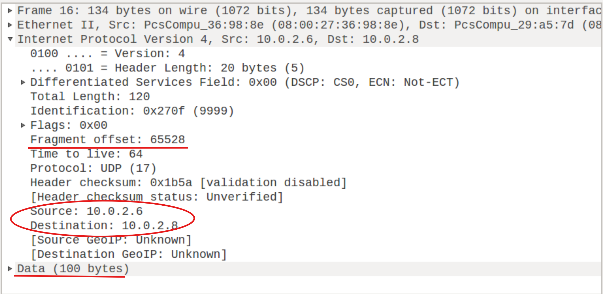

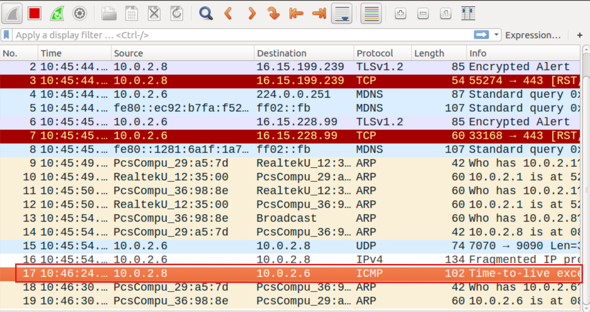

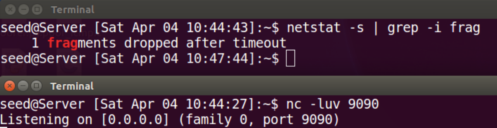

A large ping (8000-byte payload, forcing fragmentation) from the Client VM to the Server VM was tested before the attack:

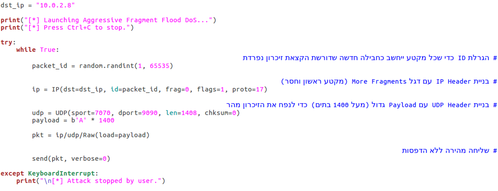

All five attack terminals were launched simultaneously:

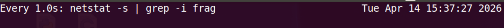

The Server's reassembly counters were monitored during the attack:

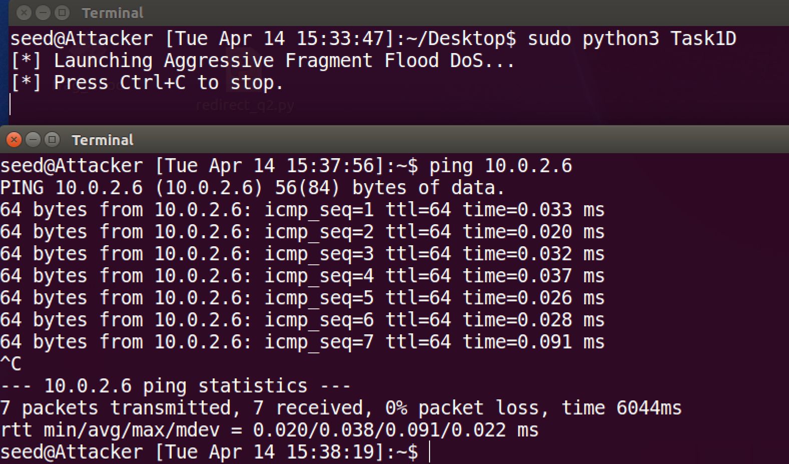

The large ping was retried from the Client VM during the attack:

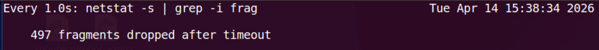

**Result:** The C-based flood successfully exhausted the kernel's reassembly buffer. Legitimate fragmented traffic from the Client was dropped because the kernel had no space to hold its fragments during reconstruction — a successful DoS.

**Why 5 terminals?** Sending from 5 parallel processes multiplied the packet rate, ensuring the fill rate exceeded the timeout-based eviction rate.

---

## Task 2: ICMP Redirect Attack

### Background

ICMP Redirect (Type 5, Code 1) is sent by routers to inform a host of a shorter path to a destination. The receiving host updates its routing cache accordingly. An attacker on the LAN can forge these messages — impersonating the legitimate gateway — to redirect a victim's outbound traffic through the attacker machine, enabling a MITM or DoS.

### Objective

Force the Server VM (`10.0.2.8`) to redirect all traffic destined for `8.8.8.8` through the Attacker VM (`10.0.2.6`) by sending spoofed ICMP Redirect packets that appear to come from the real gateway (`10.0.2.1`).

### Implementation

The Python script listens for outbound traffic from the Server and responds with a spoofed ICMP Redirect. The spoof logic:
- `IP.src = 10.0.2.1` (impersonates the real gateway)
- `ICMP type=5, code=1` (Redirect for Host)
- `ICMP.gw = 10.0.2.6` (the attacker's IP as the new next-hop)
- The original IP header is appended to the ICMP payload as required by the protocol

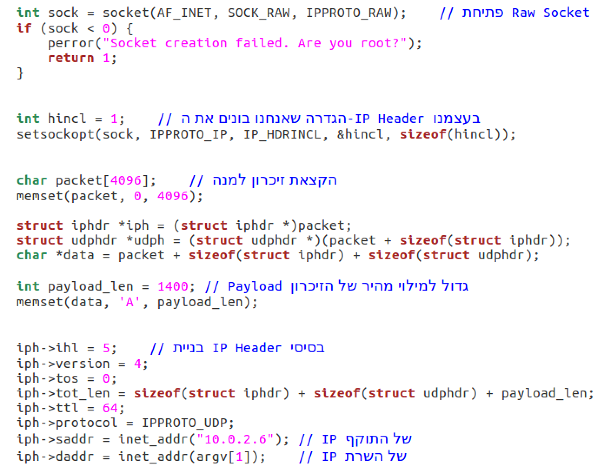

IP forwarding was enabled on the Attacker so the Server does not lose connectivity:

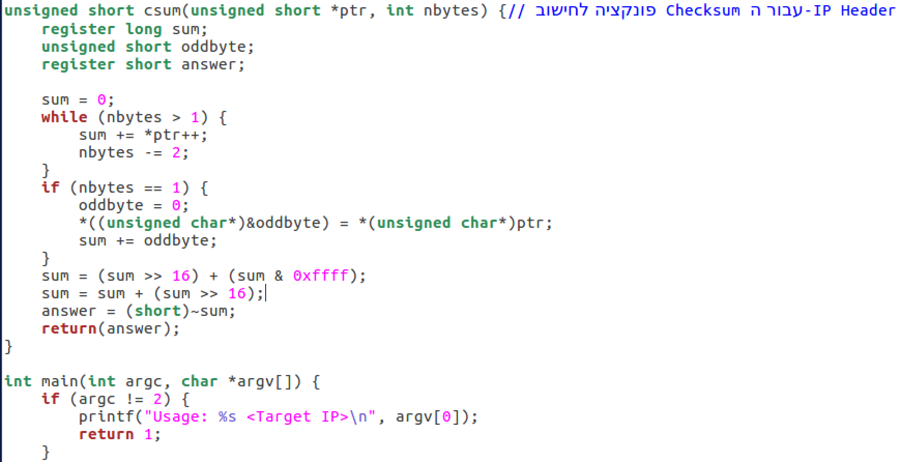

The Server was already sending legitimate traffic. The attack script was started, with the Server simultaneously pinging `8.8.8.8`:

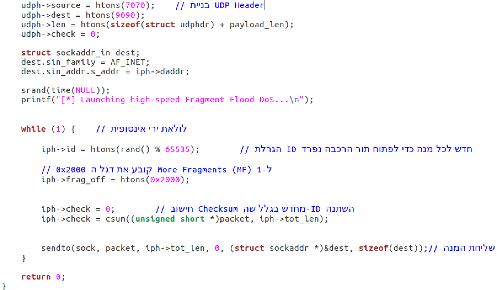

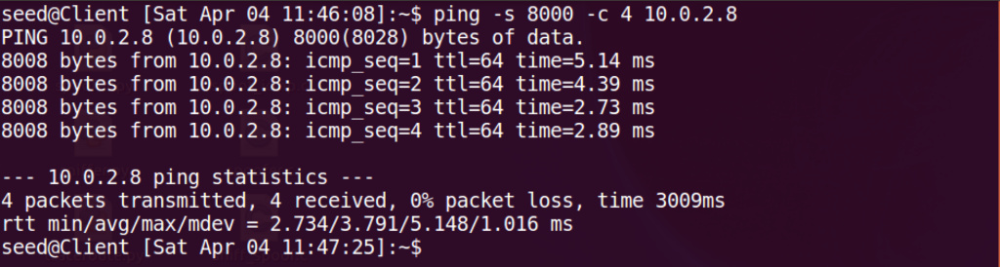

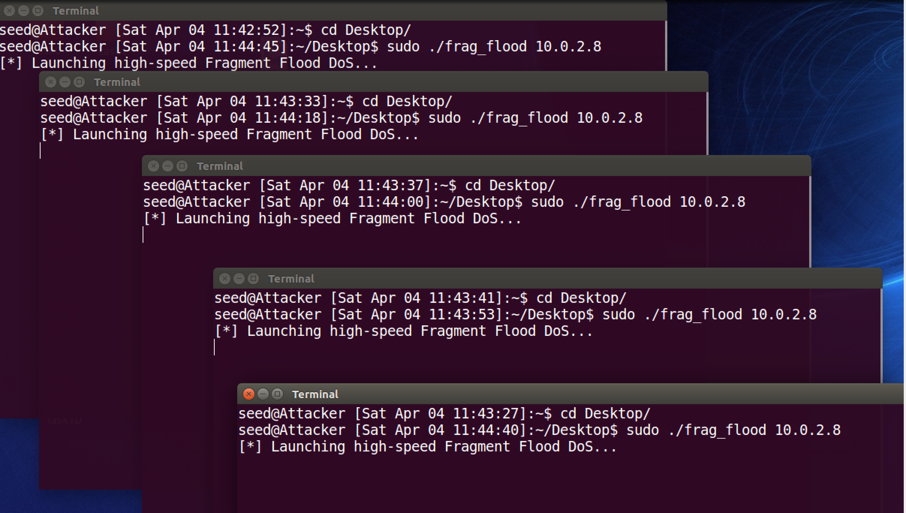

Final verification using `ip route get` on the Server confirms the routing cache was poisoned:

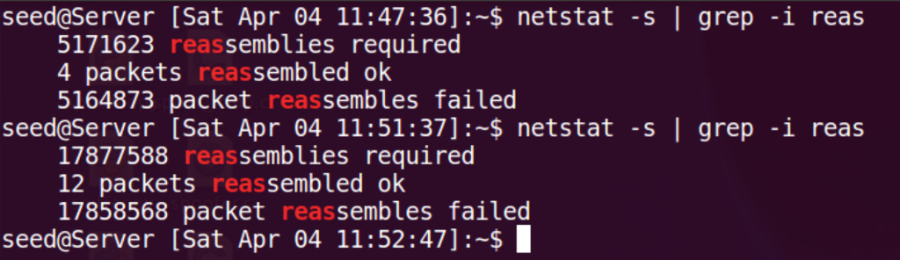

Attacker terminal confirming Redirect packets were sent:

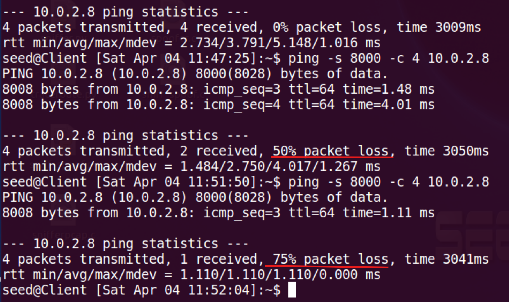

**Result:** The `<redirected>` flag in the routing output confirms the Server's kernel updated its routing cache based on the forged ICMP Redirect. All subsequent traffic to `8.8.8.8` was routed through the Attacker.

### Redirect Research Questions

**Q1: Can an ICMP Redirect point to a remote machine (e.g., 8.8.8.8)?**

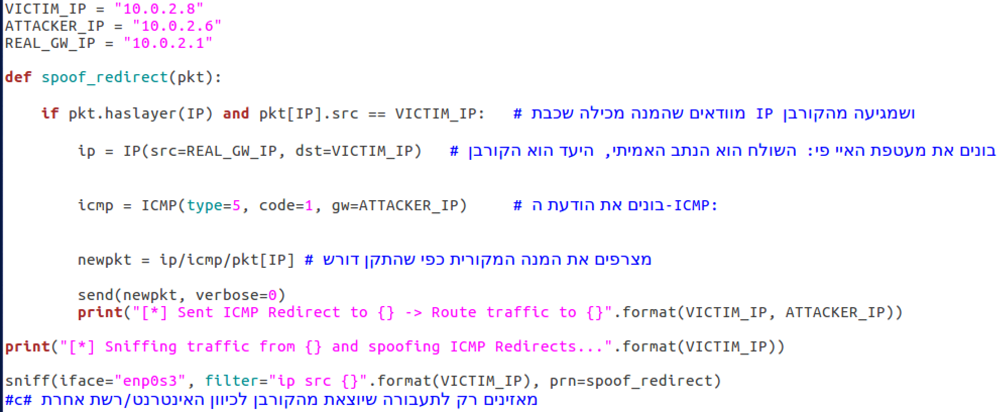

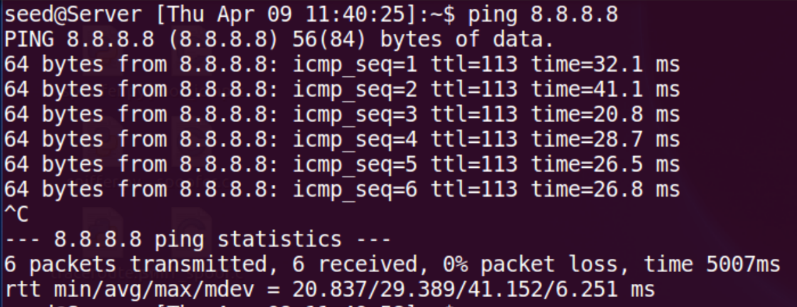

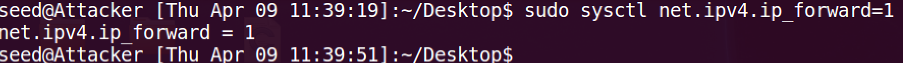

**No.** Ubuntu performs a sanity check on the new gateway address: if `icmp.gw` is not in the same subnet as the interface the redirect arrived on, the kernel discards the redirect as illogical (you cannot communicate at Layer 2 with a gateway that is not on the same LAN segment).

---

**Q2: Can an ICMP Redirect point to a non-existent LAN machine (e.g., 10.0.2.99)?**

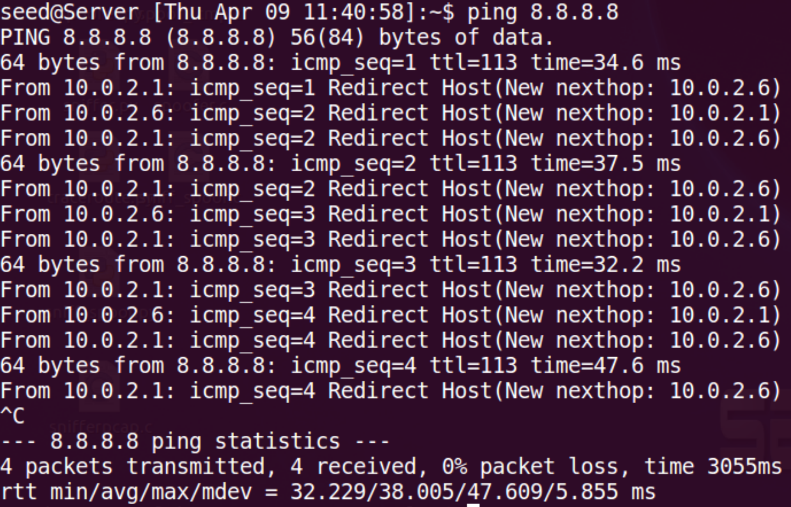

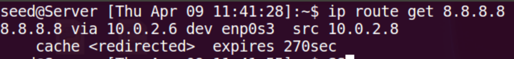

**Yes — and it causes a targeted DoS.** The routing table is updated because `10.0.2.99` passes the subnet sanity check. However, when the Server tries to send packets to that gateway, it broadcasts ARP requests for `10.0.2.99`. Since no machine exists at that address, ARP gets no response, the Ethernet frame is never built, and all outbound traffic to `8.8.8.8` is silently dropped.

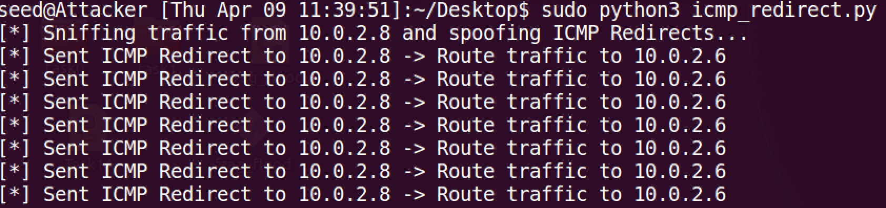

This demonstrates that ICMP Redirect can be weaponized for a targeted DoS even when the attacker does not have a valid listening machine.

---

## Task 3.a and 3.b: Multi-Subnet Routing Setup

### Background

Two machines on different subnets cannot communicate without a router. A standard Linux machine can be configured as a router by enabling **IP Forwarding** in the kernel and adding static routes on the endpoint machines.

### Network Setup

| Machine | Role | Interface 1 | Interface 2 |
|---|---|---|---|
| Client VM | Router | enp0s3: 10.0.2.7 (NAT) | enp0s8: 192.168.60.1 (Internal) |
| Server VM | Target | enp0s3: 192.168.60.5 (Internal) | — |
| Attacker VM | Source | enp0s3: 10.0.2.6 (NAT) | — |

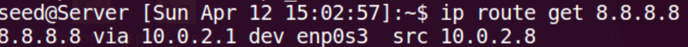

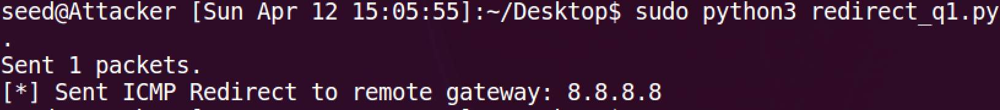

IP Forwarding was enabled on the Router:

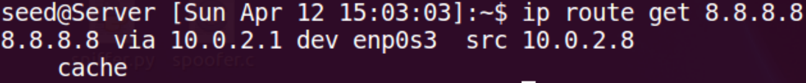

Static routes were added in both directions:

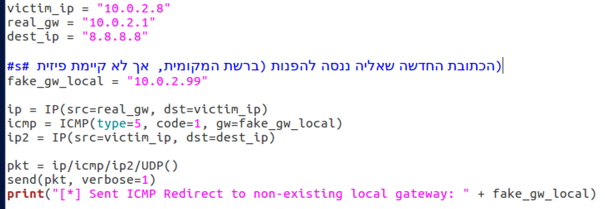

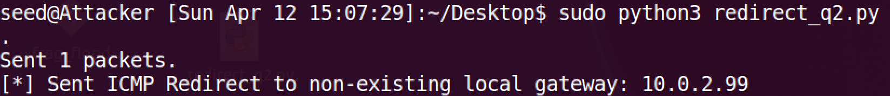

Connectivity verification from Attacker to Server:

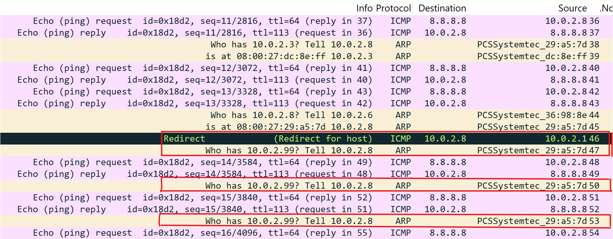

**Key point:** Routing is bidirectional. Without the return route on the Server, pings would appear to succeed on the Attacker but the Server would silently drop reply packets because it had no route back to `10.0.2.0/24`.

---

## Task 3.c: Reverse Path Filtering (RPF) Bypass Research

### Background

**Reverse Path Filtering (rp\_filter)** is a Linux kernel mechanism that defends against IP Spoofing by validating the source address of incoming packets. When enabled, the kernel checks whether a packet destined back to the source IP would exit via the same interface the packet arrived on. If not, the packet is dropped.

Two modes:
- **Strict RPF (`rp_filter=1`):** The return path must use exactly the same interface as the incoming packet.
- **Loose RPF (`rp_filter=2`):** The return path just needs to exist somewhere in the routing table, regardless of interface.

---

### Phase A: Strict RPF — Bypass Attempt

Three spoofed ICMP packets were sent toward the internal network (`192.168.60.5`):
1. Source `10.0.2.99` (same subnet as the router's external interface)
2. Source `192.168.60.1` wrapped inside an outer IP packet (IP-in-IP encapsulation attempt)
3. Source `1.2.3.4` (a random internet address)

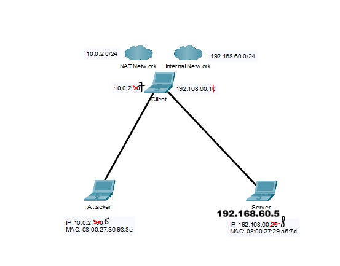

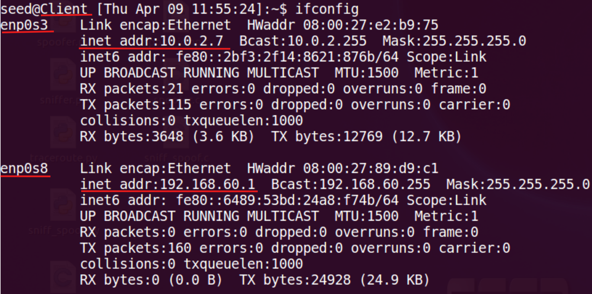

Wireshark on the Router captured both interfaces simultaneously:

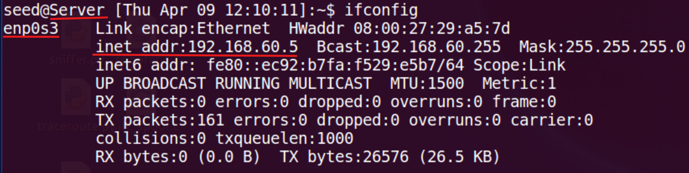

**All three attempts failed.** Strict RPF dropped every packet before it reached the forwarding logic. The IP-in-IP encapsulation bypass also failed — the Linux kernel does not auto-decapsulate inner IP headers without an explicit tunnel interface (e.g., `ipip` or `tun`) configured.

---

### Phase B: Loose RPF — Successful Bypass

In enterprise environments with asymmetric routing, `rp_filter=2` (Loose) is commonly used. The Router was switched to Loose RPF:

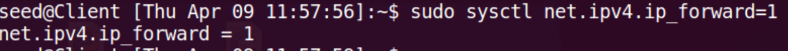

The Attacker's routing table was updated to include the internal subnet:

A forged packet with source `192.168.60.99` (impersonating an internal machine) was sent to `192.168.60.5`:

Wireshark captured the result on the Router:

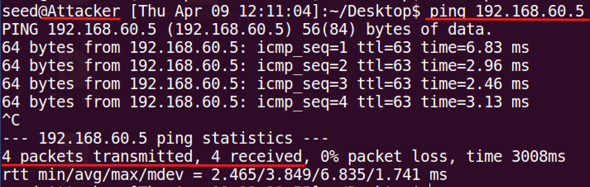

**The attack succeeded.** Packet 18/19 appears on both interfaces, confirming the Router forwarded the spoofed packet from the external NAT interface to the internal segment. Under Loose RPF, the check passes because `192.168.60.0/24` exists in the routing table — even though it should only be reachable from the internal interface.

The Server sent ARP requests looking for `192.168.60.99` (Host Unreachable error in Wireshark), confirming the packet reached the internal subnet.

**Security implication:** Loose RPF allows an external attacker to impersonate internal hosts. This bypasses firewalls and ACLs that trust traffic based on source IP address, potentially granting access to internal services that should not be reachable from outside.

---

## Lab Summary

### Attack Results

| Task | Attack | Result | Defense |
|---|---|---|---|
| 1.a | IP Fragmentation | Reassembly successful | Manual offset calculation required |
| 1.b | Overlapping Fragments | Linux enforces Favor Lower Offset | No crash — data conflict resolved silently |
| 1.c | Ping of Death | No crash on modern kernel | Kernel validates reassembled size before allocating buffer |
| 1.d | Fragment Flood DoS | 50–75% packet loss achieved with C/5 threads | Python too slow; C at full speed required |
| 2 | ICMP Redirect | Routing cache poisoned | IP forwarding on attacker kept communication transparent |
| 3.a/b | Cross-subnet routing | Successful with ifconfig + ip route | Both directions required |
| 3.c | RPF bypass | Strict: blocked; Loose: successful | Strict RPF defeats spoofing; Loose RPF creates a bypass path |

### Core Lessons

1. **Fragmentation is a rich attack surface.** Offset arithmetic, overlap handling, and assembly buffer exhaustion are all exploitable attack vectors.
2. **Tool choice determines success.** Python/Scapy is ideal for precise packet construction but too slow for flood attacks. C/Raw Sockets achieves near-line-rate speeds.
3. **ICMP Redirect is LAN-scoped.** The target gateway must be on the same subnet. This limits the attack but makes it highly effective within a compromised LAN segment.
4. **RPF mode matters.** Strict RPF effectively blocks spoofed packets; Loose RPF creates an exploitable path for source address impersonation in enterprise topologies.
