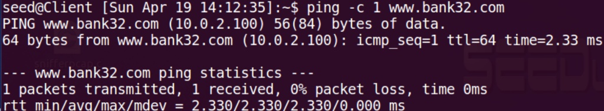
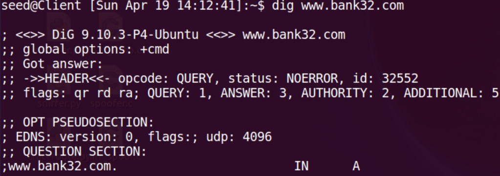
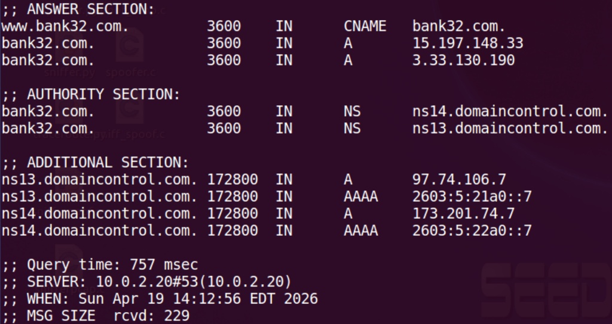
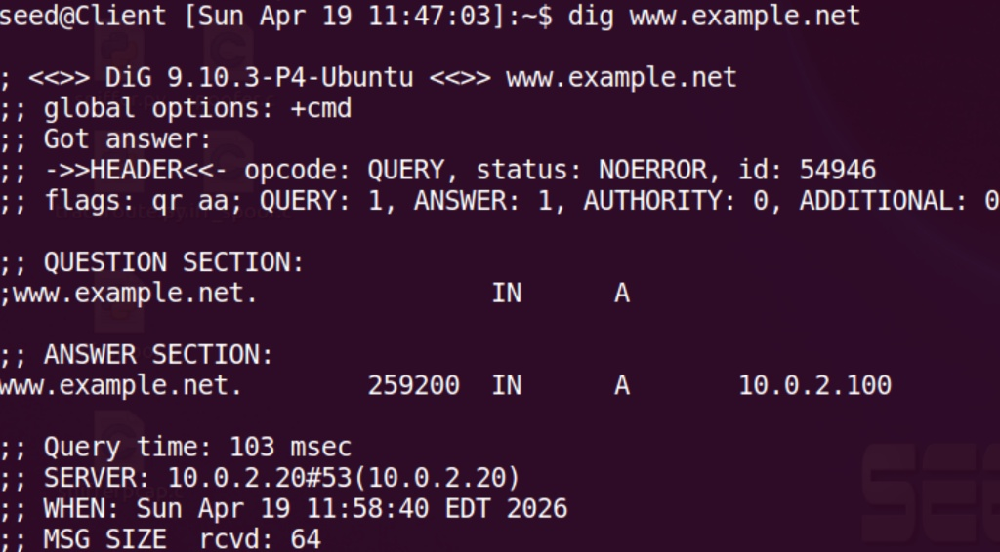
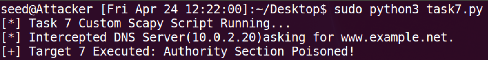
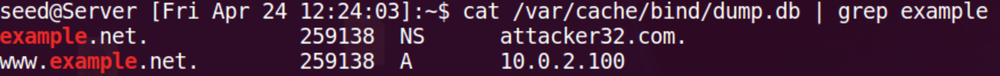
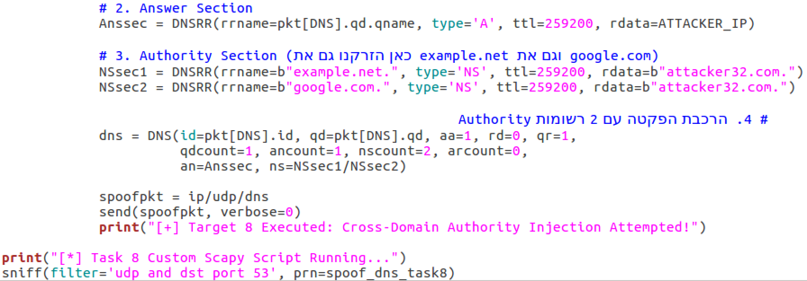

# Lab 3: Local DNS Attacks

**SEED Labs — Network Security Laboratory**
**Team:** Bar Sberro (314683665) · Shalev Cohen (314745456) · Noam Hadad (3147014118)

---

## Network Topology

Three virtual machines on the `10.0.2.0/24` subnet:

| Role | IP Address |
|---|---|
| Client (victim) | 10.0.2.10 |
| Local DNS Server (BIND9 resolver) | 10.0.2.20 |
| Attacker | 10.0.2.100 |


---

## Tasks 1–3: Environment Setup and Local DNS Configuration

### Background

A DNS server can serve two roles simultaneously:
- **Recursive Resolver:** Accepts queries from clients for external domains (e.g., `www.google.com`), iterates through the DNS hierarchy to resolve them, and caches results.
- **Authoritative Nameserver:** Holds Zone Files for specific domains (e.g., `example.com`) and responds directly without contacting external servers.

### Task 1: Configure Client to Use the Local DNS Server

The Client's `/etc/resolv.conf` was updated to point to the local DNS server.


The output confirms the Client directs all DNS queries to `10.0.2.20` — not an external resolver.

> **Pitfall:** `/etc/resolv.conf` is auto-managed by `resolvconf` on Ubuntu. Direct edits are overwritten on reboot. The correct approach is to configure the interface's DNS settings and use `resolvconf` to regenerate the file, or to edit the head template (`/etc/resolvconf/resolv.conf.d/head`).

### Task 2: Test Recursive Resolution — External Query

A query for `www.google.com` was sent from the Client. Wireshark was used to observe the query reaching the local resolver.


The resolver forwarded the query to external authoritative servers and returned the answer:


The answer contained 8 real IP records for `www.google.com`, obtained through BIND9's recursive resolution process (using the configured forwarder). This confirms the recursive resolver function is operational.

### Task 3: Test Authoritative Resolution — example.com Zone

The DNS server was configured as an authoritative server for `example.com` with a Zone File mapping the domain to `10.0.2.20`. A `dig` query from the Client verified authoritative response:


The `aa` flag in the DNS response header confirms that the answer came directly from the locally configured zone, not from an upstream server. Query time was 2 ms — consistent with a local cache hit rather than an external resolution.


**Summary:** The DNS infrastructure is correctly configured. The Client trusts `10.0.2.20` as its resolver, the resolver can recursively resolve external domains, and it is authoritative for the locally-defined `example.com` zone.

---

## Task 4: Hosts File Poisoning

### Background

The `/etc/hosts` file is checked by the OS **before** sending a DNS query. Any entry in `hosts` overrides the DNS server completely. If an attacker gains write access to a victim's `hosts` file (e.g., via a compromised system or malware), they can redirect any domain to any IP address without the DNS server ever being consulted.

### Objective

Add an entry to the Client's `/etc/hosts` that maps `www.bank32.com` to the attacker's IP (`10.0.2.100`), simulating a phishing redirect.

### Execution

**Step 1:** The Client's `/etc/hosts` file was edited to add:
```
10.0.2.100    www.bank32.com
```

**Step 2:** `ping www.bank32.com` was run from the Client.


**Step 3:** `dig www.bank32.com` was run to show that `dig` bypasses `/etc/hosts` and queries DNS directly.



**Conclusion:** `ping` (and web browsers) consult `/etc/hosts` first — a poisoned entry redirects the user silently. `dig` bypasses `/etc/hosts` entirely and queries the DNS server directly, so it is immune to hosts-file poisoning. This distinction is important for security auditing.

**Defense:** `/etc/hosts` requires root to edit. Protection relies on access control: prevent unauthorized root access and monitor file integrity (e.g., `auditd` rules on `/etc/hosts`).

---

## Task 5: Direct DNS Spoofing (Sniff and Respond)

### Background

On the same LAN, an attacker can observe DNS queries in transit (sniffing) and inject a forged DNS response before the legitimate response arrives. DNS uses UDP, which has no connection state — the first valid response with the correct Transaction ID wins.

The spoofed response must match:
- The **Transaction ID** from the observed query
- The **Source/Destination IP and port** (swapped from the query)
- The `aa=1` flag (Authoritative Answer)
- A forged A record pointing to the attacker's IP

### Objective

Forge a DNS response to the Client's query for `www.example.net`, returning the attacker's IP (`10.0.2.100`) instead of the real address.

### Implementation

A Python/Scapy script was written to sniff UDP port 53 and react to each DNS query for `www.example.net`:





**Step 1:** The spoofer script's key logic — Transaction ID matching and field construction:

![Script detail: pkt[DNS].id copied to response, qd= copied, aa=1 set, DNSRR with attacker IP injected](assets/screenshot-13.png)


**Step 2:** The spoofer was launched with `sudo`:

The script printed `"Sniffing UDP port 53..."` confirming it was waiting for DNS queries.

**Step 3:** The Client issued a `dig www.example.net` query:


**Step 4:** Verification that the DNS server (`10.0.2.20`) itself was not involved — the response came before the resolver could forward the query to the internet.

**Result:** The Client received `10.0.2.100` for `www.example.net`. The real answer from the internet was either never received or arrived after our forged response had already been accepted.

**Summary:** This attack works because DNS over UDP has no source authentication. As long as the Transaction ID matches and the response arrives first, the client accepts it. The window is small but on a LAN where the attacker can observe queries in real time, winning the race is straightforward.

---

## Task 6: DNS Cache Poisoning Attack

### Background

Task 5 required the attacker to be present for every query and win a live race condition. Cache Poisoning is more powerful: by poisoning the **resolver's cache**, all clients behind that resolver are affected for the duration of the TTL — a single successful injection can persist for hours or days.

The attack targets the Local DNS Server (`10.0.2.20`) directly, not the Client. If the resolver's cache maps `www.example.net` to the attacker's IP, every client querying through this resolver will receive the forged answer without the attacker needing to be present.

### Objective

Inject a forged A record for `www.example.net` with a 259,000-second TTL into the resolver's cache.

### Execution

**Setup:** The resolver's cache was flushed with `rndc flush`, and a cache dump was taken before the attack to confirm a clean state.




**Step 1:** The cache poisoning script was written to target the resolver directly. Unlike Task 5 which targeted the Client, this script sends a forged response to the resolver at `10.0.2.20`:


**Step 2:** The script was launched (`sudo python3 Task6.py`). A `dig www.example.net` was then issued from the Client to cause the resolver to query outbound — the script intercepted that outbound query and injected the forged response.

The cache dump was extracted from the resolver:


**Step 3:** A Client query verified the poisoned cache was served to end users:

The resolver returned `10.0.2.100` from its cache (query time: near-zero milliseconds — confirming a cache hit, not a fresh internet resolution).

**Summary:** Cache poisoning is a force multiplier: one successful injection affects all clients behind the resolver for the full TTL duration. The attacker does not need to be on the network again until the TTL expires.

> **Problem solved:** Timing was critical. If the script launched too slowly, the resolver received the legitimate response first and cached it. The `rndc flush` command was used before each attempt to reset the cache and guarantee a clean injection opportunity.

---

## Task 7: Targeting the Authority Section

### Background

A DNS response contains multiple sections:
- **Answer Section:** The direct answer to the query (A record for the queried name)
- **Authority Section:** The NS (Name Server) records declaring which server is authoritative for the domain
- **Additional Section:** Glue records (A records for the NS servers themselves)

Poisoning the **Authority Section** is more powerful than poisoning a single A record: if an attacker can replace the NS record for `example.net`, then all future queries for any subdomain under `example.net` (`mail.example.net`, `ftp.example.net`, etc.) will be directed to the attacker's DNS server.

### Objective

Replace the NS record for `example.net` in the resolver's cache with `attacker32.com` — making the attacker's machine the declared authority for the entire `example.net` domain.

### Execution

A Scapy script was written to inject a forged Authority Section alongside the Answer Section when the resolver queries for `www.example.net`:


The forged answer contained:
- **Answer:** `www.example.net` → `10.0.2.100`
- **Authority:** `example.net NS attacker32.com`

The resolver accepted this response (no Bailiwick Rule violation — `attacker32.com` is inside the `example.net` namespace boundary... actually it is out-of-bailiwick, which is tested further in Task 8).

The cache dump showed:

```
example.net   NS   attacker32.com
```

**Significance:** With the NS record poisoned, all subsequent queries for anything under `example.net` — including subdomains not previously queried — are forwarded to the attacker's DNS server. The attacker can return arbitrary IP addresses for any `*.example.net` query with full authority.

---

## Task 8: Bailiwick Rule and Decoupled Poisoning (Beyond Requirements)

### Background

The **Bailiwick Rule** is BIND9's protection against cross-domain cache injection. When a DNS response contains NS records in the Authority section, the resolver checks: is the NS record's domain within the namespace of the original query? Records that are "Out-of-Bailiwick" are silently discarded and never cached.

**Example:** A response to a query for `example.net` may include an Authority record for `example.net` (in-bailiwick) but not for `google.com` (out-of-bailiwick).

### Phase A: Piggybacking Attempt (Single-Packet Injection)

A Scapy script was written that responds to a query for `example.net` with two Authority records in the same packet: one for `example.net` (legitimate) and one for `google.com` (cross-domain).





The script was launched:




Cache dump result:


The `example.net` NS record was accepted. The `google.com` NS record was silently dropped — confirming the Bailiwick Rule works.

### Phase B: Decoupled Poisoning (Bypass)

The Bailiwick Rule cannot be broken directly, but it can be circumvented by **opening a legitimate Bailiwick window** for the target domain through a proactive query.

**Strategy:**
1. **Channel 1 (reactive):** Respond to Client's queries for `example.net` — inject `example.net NS attacker32.com`
2. **Channel 2 (proactive):** Send a query for `google.com` from the Attacker machine — this forces the resolver to open a legitimate Bailiwick for `google.com` — then immediately inject a forged NS record for `google.com` in a separate response


The decoupled script was launched. The attacker then issued a `dig google.com @10.0.2.20` from the Attacker machine to force the resolver to query outbound for `google.com`:


The resolver's outbound query was intercepted and the forged Authority for `google.com` was injected:


The Client then queried `example.net`, and the resolver also returned the google.com poisoned entry:


Cache dump confirming both entries:


Final proof — the Client querying `www.google.com` received the attacker's address:


The 2-millisecond query time proves the answer came from the resolver's poisoned cache, not from the internet.

**Lesson:** The Bailiwick Rule cannot be broken by a single packet, but it can be outflanked by making the resolver **open the door itself** through a triggered query. The attacker exploits the resolver's own legitimate query behavior, turning the protocol's iterative resolution mechanism against itself.

---

## Task 9: Targeting the Additional Section

### Background

The **Additional Section** in a DNS response contains "glue" records — A records for the NS servers listed in the Authority Section, so the resolver doesn't need to make a separate query to find the NS server's IP. BIND9 applies the Bailiwick Rule to Additional records as well: only A records for domains within the queried namespace are accepted.

### Objective

Empirically map BIND9's filtering behavior by injecting three Additional records into a response for `www.example.net`:
1. `ns.example.net` (in-bailiwick — should be accepted)
2. `attacker32.com` (out-of-bailiwick — should be rejected)
3. `www.facebook.com` (out-of-bailiwick — should be rejected)

### Execution


> **IPv6 Race Condition:** Modern DNS resolvers send simultaneous A (IPv4) and AAAA (IPv6) queries. Without filtering by `qtype==1`, the script might respond to the AAAA query with an IPv4 record — the resolver detects the mismatch and falls back to the real internet answer. The `pkt[DNS].qd.qtype == 1` filter ensures the script only responds to IPv4 queries.

The script was launched. The Client issued a query for `www.example.net`:


Client-side result:


Cache dump — forensic analysis of what the resolver actually stored:


**Result:** Despite all three records being sent in the same packet, only `ns.example.net` (in-bailiwick) was stored. The two cross-domain entries were silently discarded by BIND9 before the resolver even forwarded the response to the Client.

**Security implication:** An attacker cannot use the Additional Section to pre-load IP addresses for arbitrary domains. To redirect a domain that is Out-of-Bailiwick, the attacker must wait for the resolver to independently query that domain's authoritative servers and intercept that outbound query separately.

---

## Lab Summary

### Attack Results

| Task | Attack | Success | Key Constraint |
|---|---|---|---|
| 1–3 | BIND9 environment setup | Yes | resolv.conf + zone file + forwarder |
| 4 | Hosts file poisoning | Yes | Requires root on victim machine |
| 5 | Direct DNS spoofing | Yes | Must win race against real response |
| 6 | DNS cache poisoning | Yes | Poisons all clients via resolver; long TTL |
| 7 | Authority Section poisoning | Yes | NS record takeover for entire domain |
| 8 | Bailiwick bypass (Decoupled) | Yes | Requires proactive trigger query |
| 9 | Additional Section filtering | Partial | In-Bailiwick glue accepted; cross-domain rejected |

### Core Lessons

1. **DNS was designed on trust.** No authentication exists in the base protocol — any machine on the LAN can forge a DNS response.
2. **Cache poisoning multiplies reach.** A single injection affects all clients behind the resolver for the full TTL duration.
3. **Authority Section poisoning is more powerful than A record poisoning.** Replacing the NS record for a zone gives the attacker control over all subdomains indefinitely.
4. **Bailiwick Rule is effective but bypassable.** Direct cross-domain injection fails. Decoupled poisoning (attacker triggers the resolver to open a legitimate query window) succeeds.
5. **IPv6 race conditions matter.** Dual A/AAAA queries create a trap for naive spoofers — the AAAA response must be filtered out.

### Suggested Further Research

1. **DNSSEC:** Cryptographic signatures on DNS records would prevent all the spoofing attacks in this lab. Even if the Bailiwick Rule is bypassed, a forged NS record without a valid DNSSEC signature would be rejected by validating resolvers.
2. **Kaminsky Attack:** The next logical step — instead of waiting for the client to query, the attacker floods the resolver with queries for random subdomains (`random123.example.com`) to continuously force new outbound queries and expand the poisoning window without waiting for TTL expiry.
