# Lab 4: Remote DNS Cache Poisoning Attack (Kaminsky Attack)

**SEED Labs — Network Security Laboratory**
**Team:** Bar Sberro (314683665) · Shalev Cohen (314745456) · Noam Hadad (3147014118)

---

## Network Topology

| Role | Hostname | IP |
|---|---|---|
| Client (victim) | User VM | 10.0.2.10 |
| Local DNS Server | Apollo | 10.0.2.20 |
| Attacker | Attacker VM | 10.0.2.100 |


---

## Tasks 1, 2, 3: Environment Setup, Local DNS Configuration, and Attacker DNS Setup

### Background

To execute a Kaminsky DNS Cache Poisoning attack, a controlled network environment is required with three roles: a victim Client, a Local DNS Server (Apollo) that performs recursive resolution, and an Attacker. The local DNS server is configured to forward queries for the attacker's domain (adrian.com) directly to the attacker's server. Security mechanisms such as DNSSEC are disabled, and the source port is fixed at 33333 to reduce entropy in the lab environment, allowing the analysis to focus solely on Transaction ID guessing.

**Goal:** Configure the Client to use Apollo as its DNS resolver, configure Apollo with a forward zone for adrian.com pointing to the attacker, set up the attacker's DNS server hosting the legitimate adrian.com zone and a forged example.com zone, and verify the full traffic flow.

---

### Step 1: Client VM Configuration and Verification

A basic DNS query was issued from the Client to verify that `/etc/resolv.conf` was configured correctly and that communication with the local DNS server was operational.


The output confirms that the Client uses the configured Local DNS Server (10.0.2.20) for name resolution rather than any external server. The response was received without errors.


---

### Step 2: Local DNS Server (Apollo) Configuration

The BIND9 server on Apollo was configured with the following settings:


**Configuration analysis:** Apollo was configured to forward all queries for `adrian.com` to the attacker's address (10.0.2.100). DNSSEC validation was disabled and the source port was fixed at 33333. With a fixed source port, the attacker knows exactly where to send spoofed replies (10.0.2.20:33333), reducing the attack's entropy to only the 16-bit Transaction ID space.

---

### Step 3: Attacker VM DNS Server Configuration

The attacker's DNS server was configured to host two zones: the legitimate `adrian.com` zone and a forged `example.com` zone.


**The objective of the entire attack is contained in this forged zone file.** The record `NS ns.adrian.com` declares that the authoritative nameserver for `example.com` is `ns.adrian.com` — this is a lie. The real authoritative server belongs to Cloudflare. After Apollo's cache is poisoned, it will believe that authority over `example.com` belongs to `ns.adrian.com`. Every query for `example.com` will then reach the attacker, who answers from this zone file:

- `example.com` → 1.2.3.4
- `www.example.com` → 1.2.3.5


This record tells Apollo that to reach `ns.adrian.com`, it must go to 10.0.2.100.

---

### Step 4: Environment Testing and Verification

The communication flow was verified using `dig`:


**Analysis:** A query for `ns.adrian.com` passed successfully through the Local DNS server to the attacker, proving the forwarder is functional. A direct query to the attacker's server `ns.adrian.com` returned the spoofed answer `1.2.3.5` with the `aa` (Authoritative Answer) flag, confirming the malicious server identifies itself as authoritative over the target domain. A query for `www.example.com` without any attack returned the real address (`104.20.23.154`) because Apollo queried the legitimate authoritative nameservers.


**Task Summary:** The environment was configured successfully. The Client uses Apollo (10.0.2.20) as its DNS resolver, Apollo forwards `adrian.com` queries to the attacker and has DNSSEC disabled with a fixed source port of 33333, and the attacker's server is authoritative for both `adrian.com` and the forged `example.com` zone.

---

## Task 4: Construct DNS Request

### Background

The foundation of the Kaminsky attack lies in bypassing the existing DNS cache. A direct query for `www.example.com` would cause Apollo to cache the legitimate answer (according to its TTL) and prevent re-poisoning attempts until expiry. To create a fresh attack window (Race Condition) on every attempt, the attacker forces the local DNS server to generate outgoing recursive queries toward root servers. This is done by querying random, nonexistent subdomains such as `aaaaa.example.com`. Because the record cannot exist in cache, Apollo is forced to query the internet. While Apollo waits for the legitimate server's reply, the injection window opens for spoofed responses.

**Goal:** Write a Scapy-based script that generates a DNS query for a random subdomain, send it to the Local DNS server, and analyze the traffic flow in Wireshark to confirm a valid attack window is created.

---

### DNS Trigger Script

A Python script was developed to generate a standard UDP/DNS packet:


- **IP layer:** Destination set to the local DNS server (10.0.2.20). Scapy automatically fills the source address as 10.0.2.100.
- **UDP layer:** Destination port 53.
- **DNS layer:** Query flag (`qr=0`), arbitrary Transaction ID `0xAAAA` (not relevant to the attack itself).
- **DNSQR layer:** Resolution requested for the nonexistent name `aaaaa.example.com`.

The script was executed on the attacker machine:


The output confirms the packet was created and transmitted successfully to the destination.

---

### Network Traffic Analysis (Wireshark PCAP)

Traffic was captured on the Local DNS server (10.0.2.20) using a filter for `example.com`:


**Complete DNS resolution chain:** Packet #5 = attacker's trigger. Packets #6–33 = iterative resolution (Root → .COM TLD → Cloudflare). Packet #34 = final answer back to the attacker.

![Wireshark packet detail: trigger packet from 10.0.2.100 to 10.0.2.20, Transaction ID 0xaaaa, query for aaaaa.example.com, [Response In: 34]](assets/screenshot-17.png)

This is the trigger packet sent by `Query.py`. Transaction ID `0xaaaa` is the arbitrary value set in the script. The query for `aaaaa.example.com` (a nonexistent subdomain) forces the server to perform a fresh iterative lookup because this name cannot be in cache. The Wireshark cross-reference `[Response In: 34]` validates the pairing between the query and its answer.


**This packet reveals the two critical attack parameters:**

- **Source port 33333:** The fixed source port is confirmed in the UDP header. In standard BIND configuration this port would be random in the range ~1024 to 65535 (~64,000 possibilities). With the fixed port, the attacker knows exactly where to send spoofed replies: 10.0.2.20:33333.
- **Transaction ID (TxID) 0xe546:** Apollo generated a new random Transaction ID (`0xe546`) for its outgoing query, different from the trigger ID (`0xaaaa`). This 16-bit value is the only remaining unknown the attacker must guess. With 65,536 possible values, flooding ~500 spoofed packets per attempt yields a success probability of approximately `P(success) = 500/65536 ≈ 0.76%` per attempt.


The final answer returns to the attacker with the original Transaction ID `0xaaaa`, completing the resolution cycle. The SOA record in the Authority section (`elliott.ns.cloudflare.com`) indicates NXDOMAIN — confirming the subdomain `aaaaa.example.com` does not exist, as expected. The field `[Time: 0.319218125 seconds]` shows that the complete iterative resolution process took approximately **319 milliseconds — this is the attack window**.

**Task Summary:** The DNS trigger query successfully forced Apollo to initiate a full iterative resolution chain against the internet. Wireshark confirms the fixed source port 33333, the 16-bit Transaction ID space as the only remaining variable, and a 319ms attack window during which spoofed replies must arrive to win the race.

---

## Task 5: Spoof DNS Replies

### Background

In this task, a spoofed DNS Response is built using Scapy. The goal is to create a reply that appears to have arrived from the legitimate nameserver for `example.com`, but contains a forged Authority Section pointing to `ns.adrian.com` as the NS for `example.com`. The source address is spoofed to the legitimate NS address (172.64.32.162). If such a packet arrives before the legitimate response with the correct Transaction ID, Apollo will cache the forged NS record.

**Two scripts are produced:**
1. `task5_spoof.py` — sends a single spoofed response to verify correct construction
2. `generate_payloads.py` — creates binary templates (`ip_req.bin`, `ip_resp.bin`) for use by the C attack program in Task 6

---

### task5_spoof.py

The script defines `name=aaaaa.example.com` (the random subdomain trigger), `domain=example.com` (the domain to hijack), and `ns=ns.adrian.com` (the attacker's NS). The source IP is spoofed to `172.64.32.162` (a legitimate NS for example.com) and the destination is Apollo (10.0.2.20). Source port 53, destination port 33333:


Execution of the script confirmed saving and sending:

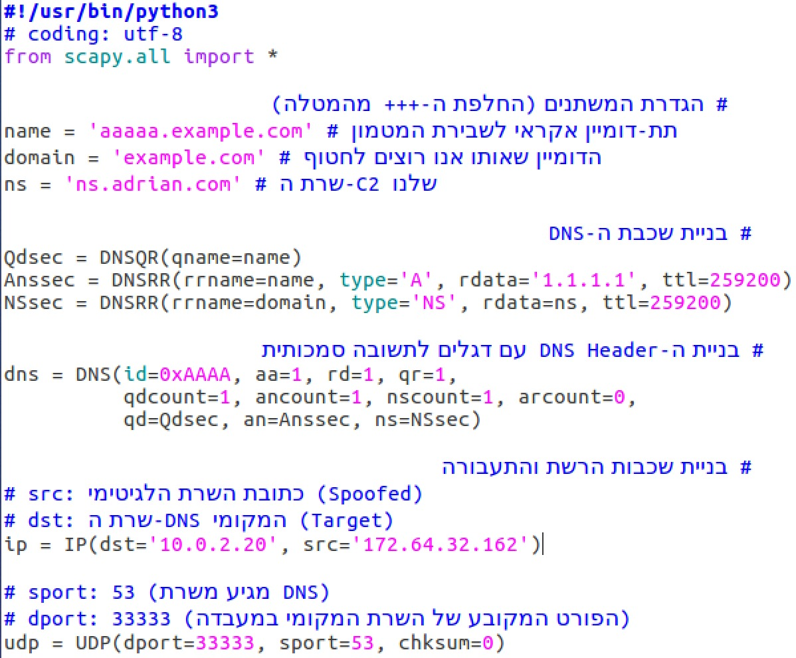

Wireshark capture of the spoofed packet:

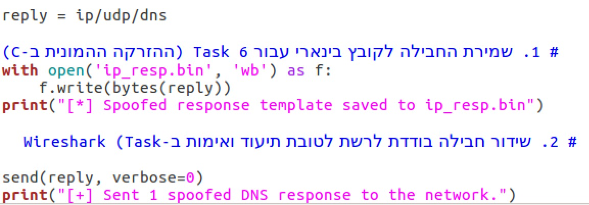

- **Queries:** `aaaaa.example.com`, type A, class IN
- **Answers:** `aaaaa.example.com → 1.1.1.1` (arbitrary address for the queried name)
- **Authoritative nameservers:** `example.com NS ns.adrian.com` — this is the critical component that poisons the cache

---

### generate_payloads.py

`generate_payloads.py` was updated with `dummy_src_ip=172.64.32.162` (the legitimate NS address for example.com) and the binary templates were regenerated for Task 6:

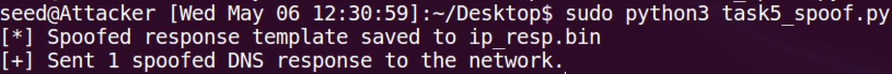


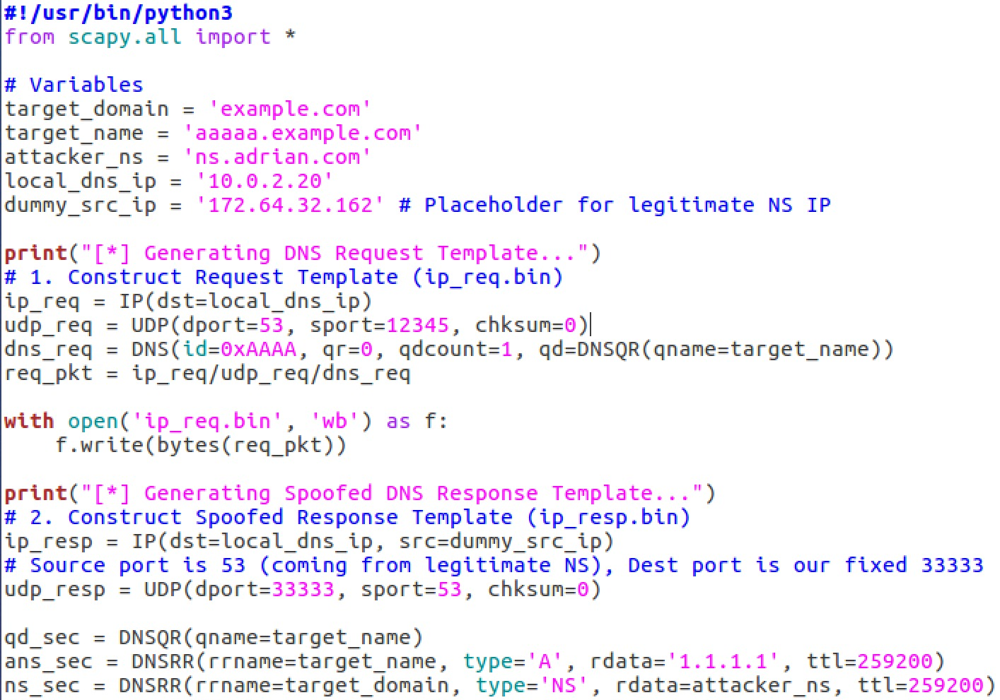

**Task Summary:** Both scripts operated as expected. `task5_spoof.py` sent a single spoofed DNS response verified by Wireshark. `generate_payloads.py` produced the binary templates `ip_req.bin` (63 bytes) and `ip_resp.bin` (134 bytes) for the C attack program. The Authority Section is the critical element — it is what causes cache poisoning when Apollo accepts the forged reply.

---

## Task 6: Launch the Kaminsky Attack

### Background

**The classic cache poisoning problem:** If Transaction ID guessing fails, the cache fills with the legitimate answer and the attacker must wait for TTL expiry (hours or days) before retrying. Kaminsky's solution: query random nonexistent names (`aaaaa.example.com`, `bbbbb.example.com`, ...) that cannot be in cache, allowing immediate retry with a new name on every iteration. In each iteration: a new trigger forces a fresh recursive query, 300 spoofed replies flood Apollo with random Transaction IDs, and the probability of a hit accumulates rapidly.

**Hybrid approach:** Scapy creates the binary templates; C code performs the high-speed flooding. Python alone is not fast enough to win the race.

---

### attack.c Implementation

The attack program is written in five parts:

**Part 1 — Includes and IP header struct:**

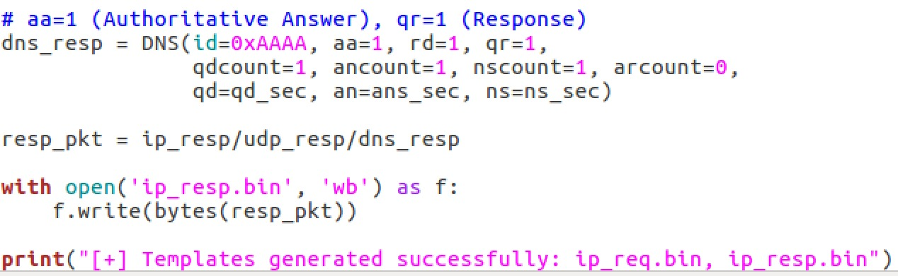

**Part 2 — `send_raw_packet()` function:**

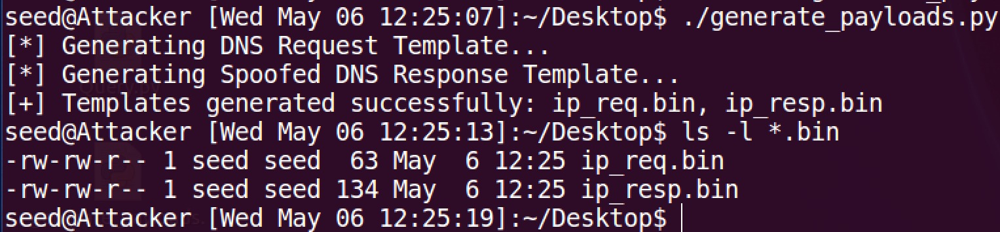

The function opens a raw socket with `IP_HDRINCL` and sends a complete pre-built packet.

**Part 3 — `main()` — load templates and prepare alphabet:**

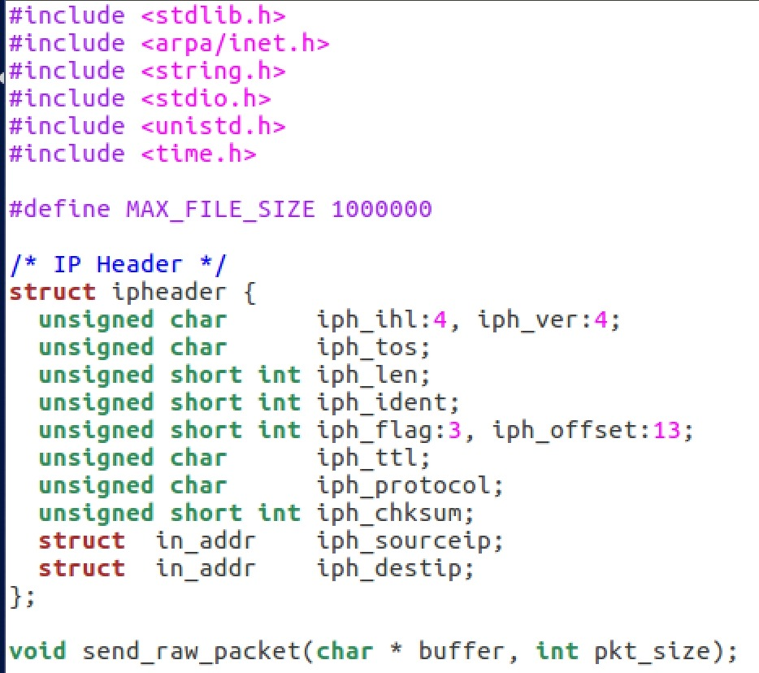

The program loads `ip_req.bin` and `ip_resp.bin` into memory buffers and prepares a 26-character alphabet string for random subdomain name generation.

**Part 4 — Dynamic offset detection:**

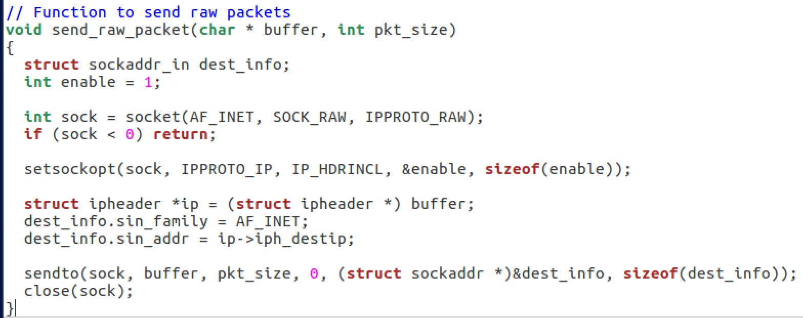

The program searches for the string `"aaaaa"` in both templates to locate the name field dynamically. The Transaction ID offset is fixed at 28 bytes (20B IP header + 8B UDP header). Dynamic detection avoids hardcoded offsets and makes the program robust against template size changes.

**Part 5 — Flood loop:**

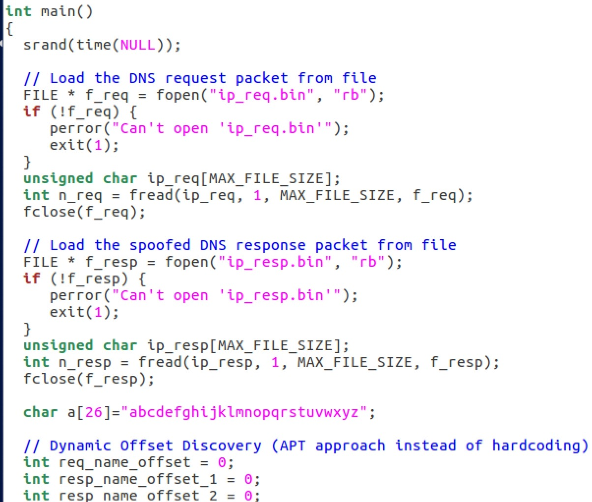

The main loop runs indefinitely. In each iteration: a random 5-character subdomain name is generated, the trigger packet is sent, and then 300 spoofed responses are sent in rapid succession, each with a different Transaction ID drawn from `rand() % 65536`.

---

### Executing the Attack

The attack was launched on the attacker machine:

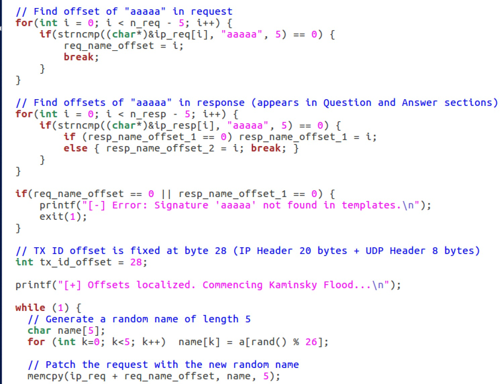

Wireshark on Apollo captured the flood: hundreds of DNS packets from `172.64.32.162` to Apollo (10.0.2.20) on port 33333, each with a different Transaction ID:

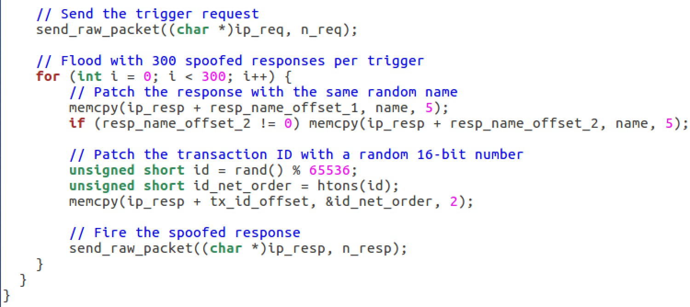

A single spoofed packet detail showing the Authority Section with `ns.adrian.com` as NS for `example.com`:

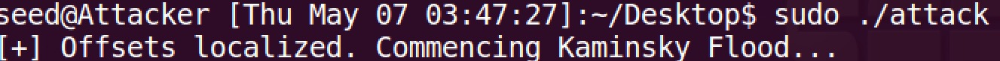

The legitimate DNS flow was also visible — Client querying Apollo, Apollo forwarding outward:

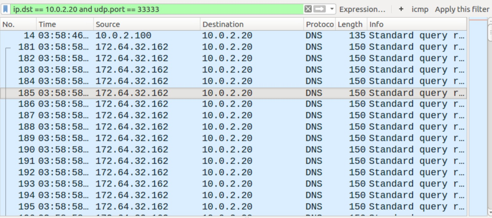

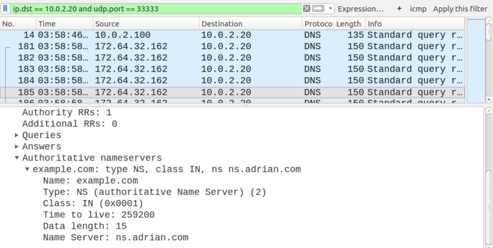

---

### Cache Poisoning Confirmed

Apollo's cache was inspected using `rndc dumpdb` after the attack succeeded:

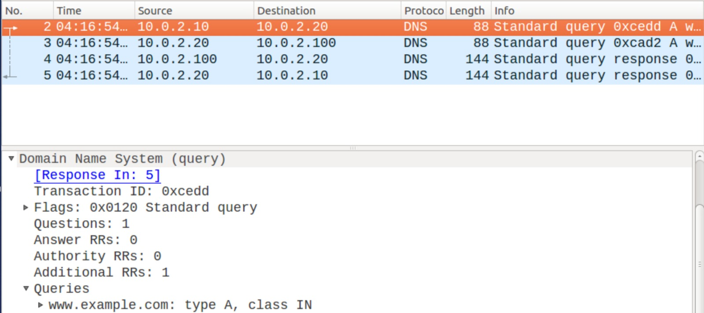

The cache dump shows `example.com. 172792 NS ns.adrian.com.` — the NS record for `example.com` has been replaced with the attacker's nameserver.

**Task Summary:** The attack succeeded. `rndc dumpdb` confirms the poisoned NS record in Apollo's cache. The 300-reply flood per trigger significantly increases the probability of guessing the correct Transaction ID per iteration. Dynamic offset detection (searching for the `"aaaaa"` string rather than hardcoding byte positions) made the attack program reliable across different template sizes. Ensuring that `dummy_src_ip` in `generate_payloads.py` matched the legitimate NS address for `example.com` was critical — Apollo rejects replies from unrecognized sources.

---

## Task 7: Result Verification

### Background

After the attack succeeds, Apollo redirects all queries for `example.com` to the attacker's server (`ns.adrian.com` = 10.0.2.100), which answers from its local zone file. This task verifies that the cache is poisoned and that all responses originate from the attacker.

---

### dig Verification from Client

`dig example.com` from the Client VM:

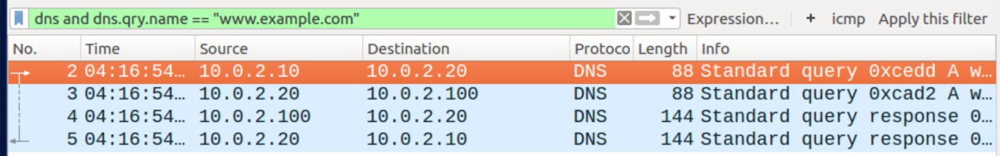

- **ANSWER SECTION:** `example.com A 1.2.3.4` (spoofed — real address is 93.184.216.34)
- **AUTHORITY SECTION:** `example.com NS ns.adrian.com`
- **ADDITIONAL SECTION:** `ns.adrian.com A 10.0.2.100` — exposes that `ns.adrian.com` is the attacker machine
- **SERVER:** 10.0.2.20 (Apollo) — confirms the poisoned cache is on Apollo

`dig www.example.com` from the Client VM:

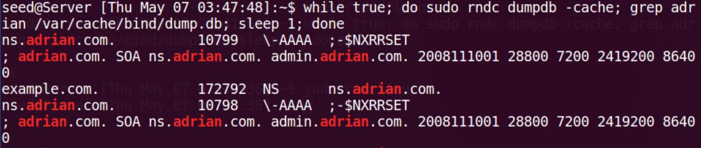

Returns `1.2.3.5` (the address from the attacker's zone file), with `ns.adrian.com` in the AUTHORITY section and a 6ms response time (from Apollo's poisoned cache). Both `dig` commands return spoofed addresses. Apollo (10.0.2.20) is the responding server but uses data injected by the attacker.

---

### Wireshark Proof of Attack Chain

Traffic was captured on Apollo during `dig www.example.com` from the Client using the filter `dns.qry.name == "www.example.com"`:

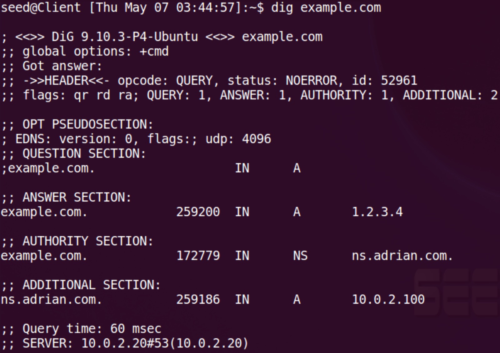

**Complete traffic chain analysis:**

1. Client (10.0.2.10) → Apollo (10.0.2.20): DNS query for `www.example.com`
2. Apollo (10.0.2.20) → Attacker (10.0.2.100): **Apollo forwards the query to the attacker instead of root servers — this is the central proof of cache poisoning**
3. Attacker (10.0.2.100) → Apollo (10.0.2.20): Response with `A=1.2.3.5`, `NS=ns.adrian.com`
4. Apollo (10.0.2.20) → Client (10.0.2.10): Forwards spoofed response to Client

Details of the query Apollo sends to the attacker:


- **Source:** 10.0.2.20 (Apollo) → **Destination:** 10.0.2.100 (Attacker)
- **Source Port:** 33333 → **Destination Port:** 53
- **Transaction ID:** 0x4d63
- **Query:** `www.example.com` type A

The fact that Apollo queries the attacker directly instead of Cloudflare's nameservers proves the authority record in the cache was successfully replaced.


- **Source:** 10.0.2.100 (Attacker) → **Destination:** 10.0.2.20 (Apollo)
- **Answer:** `www.example.com A 1.2.3.5`
- **Authority:** `example.com NS ns.adrian.com`
- **Response time:** 0.0015 seconds

Apollo receives this response and forwards it to the Client without any indication of compromise.

**Task Summary:** Both `dig` queries returned spoofed IP addresses. Wireshark confirms the complete attack chain: Apollo queries the attacker directly for `example.com` resolutions instead of consulting legitimate nameservers. After a successful cache poisoning, every user performing a DNS lookup for `example.com` is silently redirected to the attacker's server with no warning.

---

## Beyond: DNSSEC as Defense Against the Kaminsky Attack

### Background

To demonstrate the cryptographic defense against the Kaminsky attack, DNSSEC was enabled on Apollo and the attack was re-run to determine whether it could still succeed.

---

### Step 1: Enable DNSSEC on Apollo

The file `/etc/bind/named.conf.options` was edited, replacing the disabled DNSSEC lines with:

```
dnssec-validation auto;
dnssec-enable yes;
```


---

### Step 2: Re-run the Attack

After restarting BIND9 and flushing the cache, the Kaminsky attack was re-launched from the attacker machine:


---

### Step 3: Cache Inspection

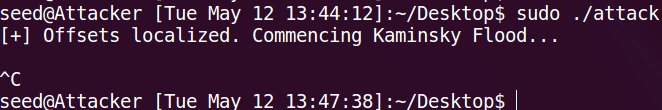

The `grep adrian` command returns empty. **The attack failed.** DNSSEC prevents Apollo from accepting DNS responses that are not cryptographically signed. Even if the Transaction ID is guessed correctly, Apollo rejects the spoofed reply because it carries no valid signature.

---

### Step 4: Client Verification


The Client receives `SERVFAIL` with `ANSWER: 0`.

**Analysis:** `SERVFAIL` is the correct behavior when DNSSEC validation fails — it is preferable to receive no answer than to receive a forged one. In a production environment where DNSSEC is fully configured with a valid chain of trust, the user would receive the real address of `www.example.com`. In this lab environment, `SERVFAIL` occurs because the `example.com` signatures require a valid trust chain that was not established. Even after 3 minutes of continuous flooding, Apollo's cache remained clean.

**Conclusion:** DNSSEC is the most effective defense against Cache Poisoning attacks. It adds RSA/ECDSA signatures to every DNS record. Even if the attacker correctly guesses the Transaction ID and wins the race, the resolver rejects the response because it lacks a valid cryptographic signature.

---

## Lab Summary

### Attack Flow

This lab demonstrated the complete Kaminsky DNS Cache Poisoning attack from environment setup through verification:

| Phase | Task | Description | Result |
|---|---|---|---|
| Setup | Tasks 1–3 | Client, Apollo (BIND9 fixed port 33333, DNSSEC disabled), Attacker DNS | Complete |
| Trigger | Task 4 | Random subdomain query forces fresh recursive lookup | 319ms attack window confirmed |
| Payload | Task 5 | Spoofed DNS reply with forged Authority Section via Scapy | ip_req.bin + ip_resp.bin created |
| Attack | Task 6 | Hybrid C/Scapy flood — 300 spoofed replies per trigger | Apollo cache poisoned |
| Verify | Task 7 | dig + Wireshark confirm Apollo queries attacker for example.com | 1.2.3.4 / 1.2.3.5 returned |
| Defense | Beyond | DNSSEC enabled on Apollo, attack re-run | SERVFAIL — attack failed |

### Core Findings

- **The fixed source port (33333) is the critical enabler in this lab.** It reduces the attack's entropy to only the 16-bit Transaction ID space (65,536 possibilities). In production DNS servers with Source Port Randomization enabled, the entropy doubles to approximately 32 bits, making the attack approximately 64,000 times harder.
- **Random subdomain querying defeats the cache.** Querying `aaaaa.example.com`, `bbbbb.example.com`, etc. ensures each attempt triggers a fresh iterative lookup, bypassing the cache TTL problem that limited earlier poisoning techniques.
- **The Authority Section is the attack vector.** The answer for the random subdomain itself is irrelevant. What matters is the NS record injected in the Authority Section — once Apollo accepts it, all future resolutions for the entire `example.com` domain are redirected to the attacker.
- **DNSSEC provides complete protection.** A cryptographic signature requirement means the Transaction ID race is irrelevant — even a correct guess is insufficient without a valid chain-of-trust signature.

### Defenses

- **DNSSEC** — cryptographic signing of all DNS records; makes Transaction ID guessing irrelevant
- **Source Port Randomization** — adds ~16 bits of additional entropy to the guessing problem (built into modern BIND by default)
- **Response Rate Limiting (RRL)** — limits reply rates to reduce the effectiveness of flooding
- **0x20 encoding** — randomizes the case of query names to add entropy to the matching process
- **Bailiwick Rule enforcement** — prevents nameservers from injecting records outside their authoritative zone
