# Lab 5: RSA Public Key Encryption and Signature

**SEED Labs : Network Security Laboratory**
**Team:** Bar Sberro · Shalev Cohen · Noam Hadad
**Date:** May 26, 2026

[← Lab 4](../lab-4/README.md) | [Index](../README.md)

---

## Contents

1. [Network Topology](#network-topology)
2. [Task 1 : Deriving the Private Key](#task-1-deriving-the-private-key)
3. [Task 2 : Encrypting a Message](#task-2-encrypting-a-message)
4. [Task 3 : Decrypting a Message](#task-3-decrypting-a-message)
5. [Task 4 : Signing a Message](#task-4-signing-a-message)
6. [Task 5 : Verifying a Signature](#task-5-verifying-a-signature)
7. [Task 6 : Manually Verifying an X.509 Certificate](#task-6-manually-verifying-an-x509-certificate)
8. [Lab Summary](#lab-summary)
9. [Beyond Requirements : Factoring Attack via FactorDB](#beyond-requirements-factoring-attack-via-factordb)

---

## Network Topology

All five computational tasks (1 to 5) run locally on a single Attacker VM. Task 6 additionally needs outbound HTTPS through NAT to fetch a real X.509 certificate from `www.reddit.com`.

| Role | OS | IP | Purpose |
|---|---|---|---|
| Attacker VM | SEEDUbuntu 16.04 | 10.0.2.100 | Host for all RSA tasks |
| NAT Gateway | (VirtualBox) | 10.0.2.1 | Egress to internet for Task 6 |

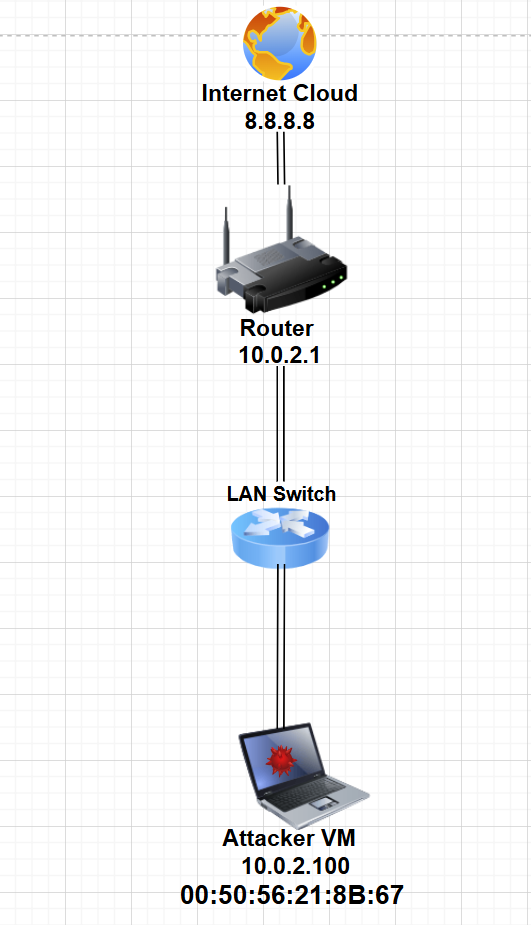

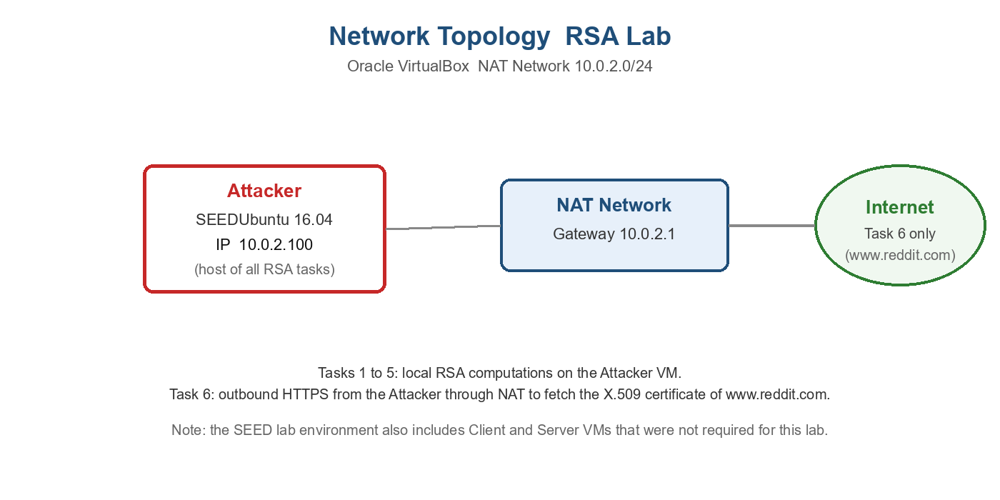

**Toolchain:** OpenSSL `BIGNUM` API in C (`BN_mod_inverse`, `BN_mod_exp`), the `openssl` command line for X.509 inspection, ASN.1 parsing, Python (FactorDB integration in the Beyond section).

---

## Task 1: Deriving the Private Key

### Background

In RSA, the public key is the pair `(e, n)` where `n = p * q` and `p`, `q` are large primes. The private exponent `d` is the modular inverse of `e` modulo Euler's totient `φ(n) = (p:1)(q:1)`:

```
e * d ≡ 1 (mod φ(n))
```

### Objective

Given `p`, `q`, and `e` from the lab instructions, compute `d` using OpenSSL's `BN_mod_inverse`.

### Implementation

A C program builds `BIGNUM` objects for `p`, `q`, `e`, computes `n = p*q` and `φ(n) = (p:1)(q:1)`, then derives `d`:

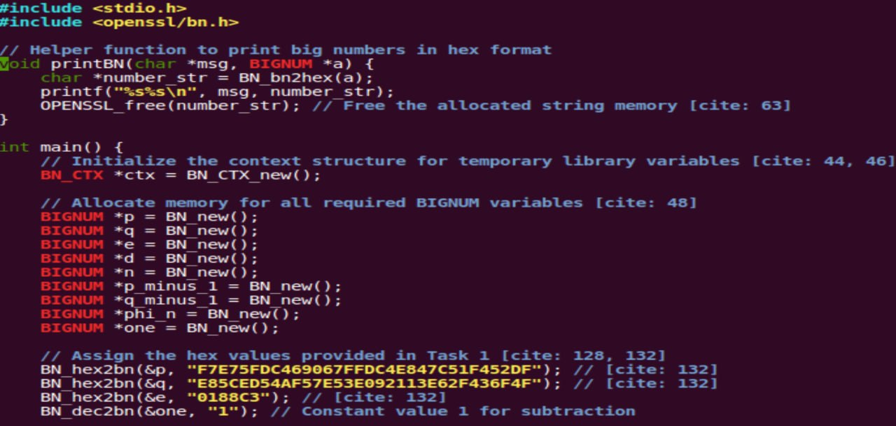

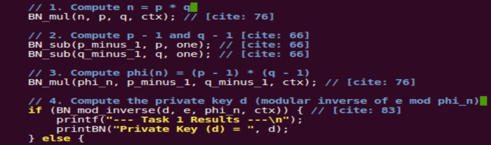

### Execution

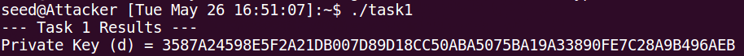

**Result:**

```
d = 3587A24598E5F2A21DB007D89D18CC50ABA5075BA19A33890FE7C28A9B496AEB
```

### Summary

The recovered `d` satisfies `e * d ≡ 1 (mod φ(n))` and is the canonical private exponent corresponding to the supplied public modulus. This `d` is reused in Tasks 3, 4, and recovered independently in the Beyond Requirements section.

---

## Task 2: Encrypting a Message

### Background

RSA encryption of a message `M` under the public key `(e, n)` produces ciphertext:

```
C = M^e mod n
```

### Objective

Encrypt the ASCII string `"A top secret!"` and verify by decrypting with `d` from Task 1.

### Implementation

`task2.c` converts the ASCII bytes to a hex string, parses into a `BIGNUM`, and calls `BN_mod_exp`:

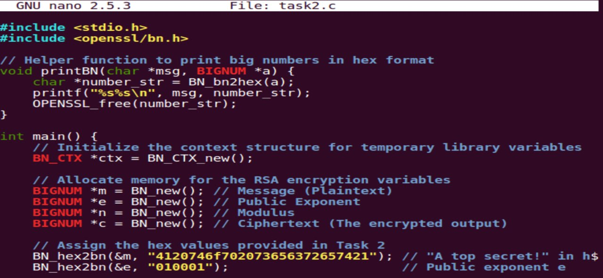

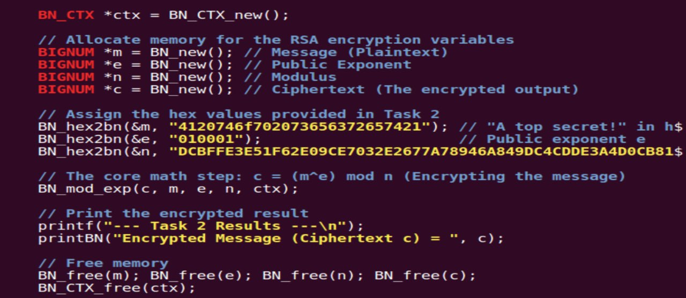

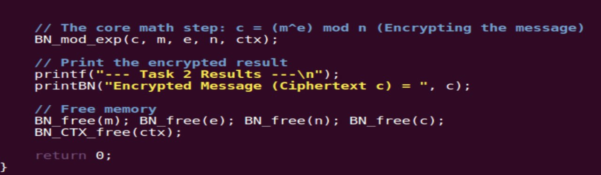

### Execution

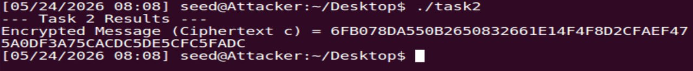

**Result:**

```
C = 6FB078DA550B2650832661E14F4F8D2CFAEF475A0DF3A75CACDC5DE5CFC5FADC
```

### Summary

Encryption succeeded. The ciphertext can be decrypted with `d` (Task 3 verifies the inverse operation on a separately supplied ciphertext).

---

## Task 3: Decrypting a Message

### Background

RSA decryption with the private key `(d, n)` recovers the plaintext:

```
M = C^d mod n
```

### Objective

Decrypt the ciphertext supplied by the lab instructions and convert the resulting bignum back to readable ASCII.

### Implementation

`task3.c` loads `n`, `d`, and the supplied `C`, computes `M = C^d mod n`, then formats the result as a hex string for ASCII conversion:

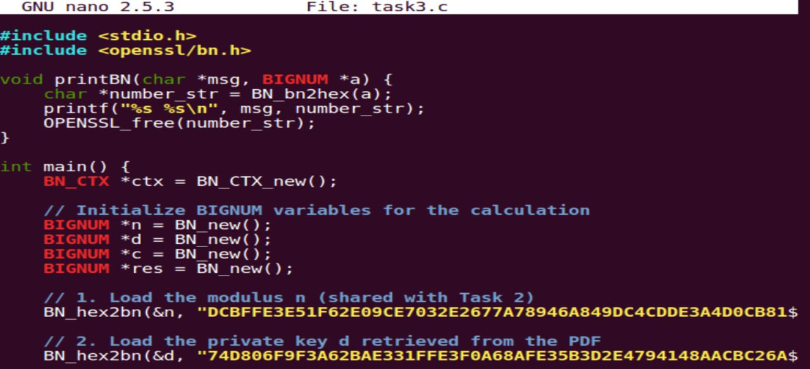

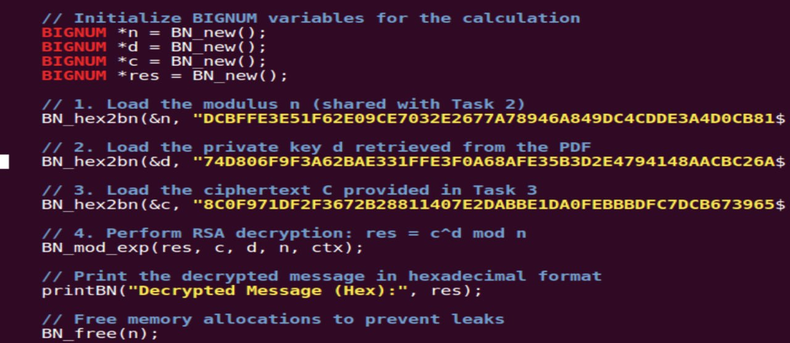

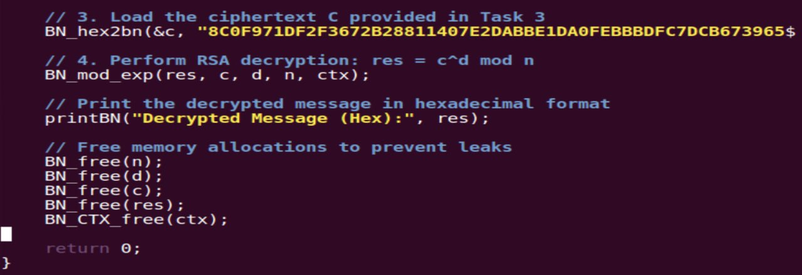

### Execution

The hex output was piped through a one liner to print the ASCII:

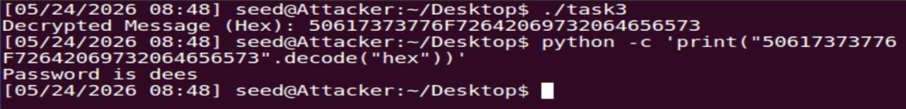

**Result:**

```
Decrypted Message: "Password is dees"
```

### Summary

Decryption is the mathematical inverse of encryption. Only the holder of `d` can read the plaintext, which is the entire point of the public key construction.

---

## Task 4: Signing a Message

### Background

An RSA digital signature on message `M` is produced with the private key:

```
S = M^d mod n
```

A core property of digital signatures is **avalanche**: any single bit change in `M` should produce a completely different `S`.

### Objective

Sign two near identical messages and compare:

* `M1 = "I owe you $2000."`
* `M2 = "I owe you $3000."`

### Implementation

`task4.c` signs both messages with the same private key and prints each signature:

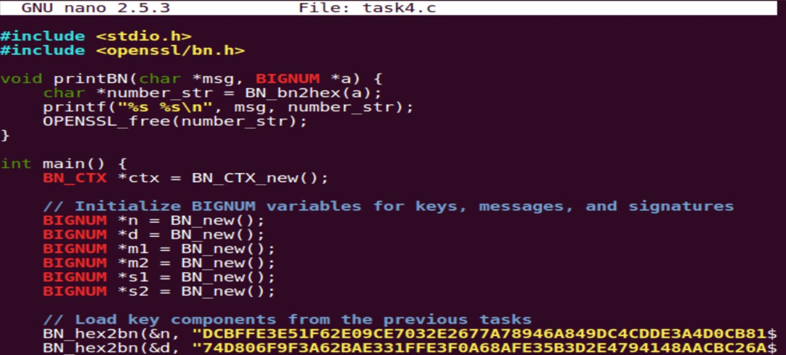

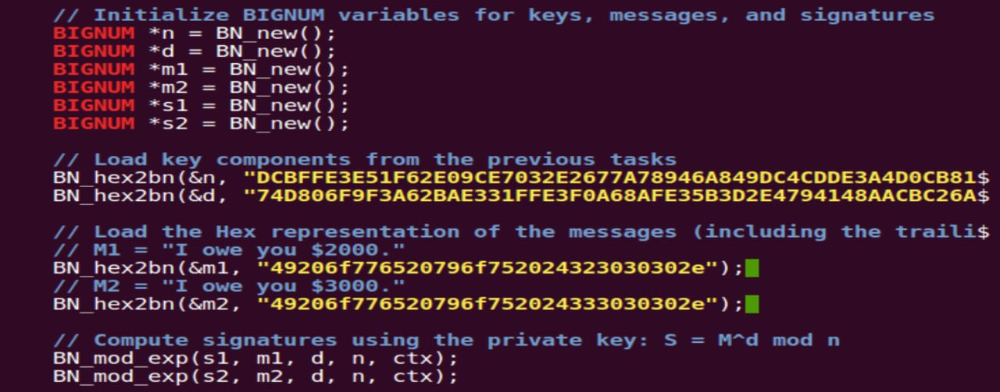

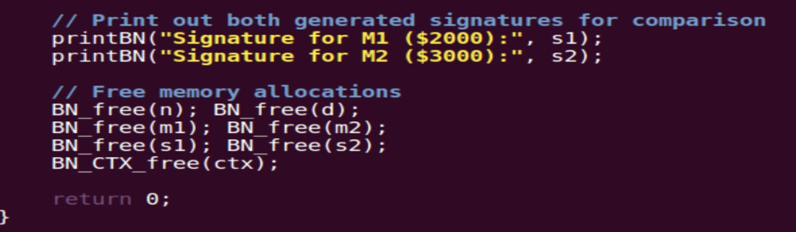

### Execution

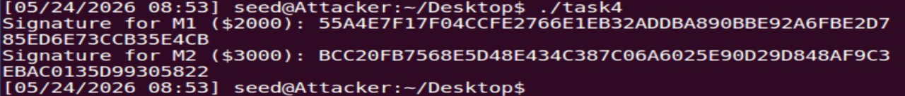

**Results:**

```
Signature M1 ($2000): 55A4E7F17F04CCFE2766E1EB32ADDBA890BBE92A6FBE2D785ED6E73CCB35E4CB
Signature M2 ($3000): BCC20FB7568E5D48E434C387C06A6025E90D29D848AF9C3EBAC0135D99305822
```

A one byte difference in `M` (the digit `2` versus `3`) produces a fully decorrelated signature.

### Summary

The avalanche property guarantees integrity. An attacker cannot mutate a signed message even slightly without invalidating the signature, because they would need to recompute `S = M'^d mod n` and that requires knowledge of `d`.

---

## Task 5: Verifying a Signature

### Background

Verification recovers the message hash by raising the signature to the public exponent:

```
M' = S^e mod n
```

If `M' == M` the signature is authentic. If a single bit of `S` is flipped, `M'` differs completely.

### Objective

Verify Alice's signature on `"Launch a missile."` using her public key, then test the same code path against a corrupted signature (last byte changed from `2F` to `3F`).

### Implementation

`task5.c` loads the public key and two candidate signatures, recovers `M1'` and `M2'`, and reports whether each matches the expected hex of `"Launch a missile."`:

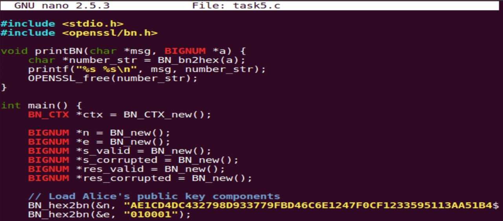

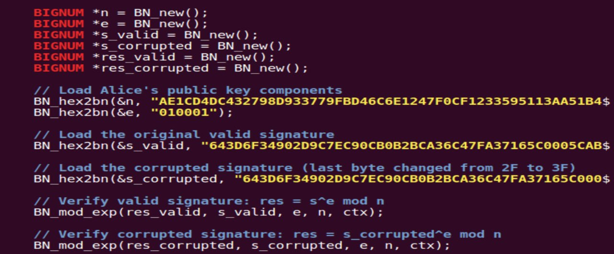

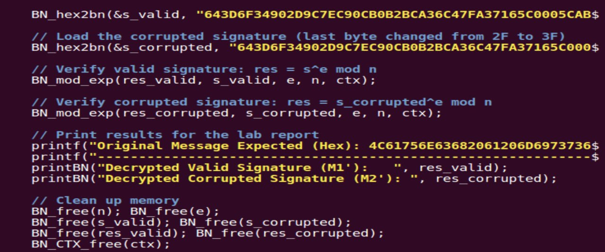

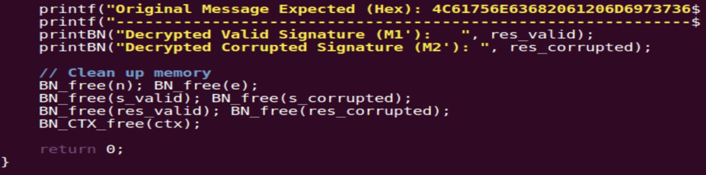

### Execution

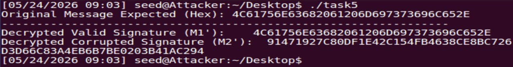

**Results:**

```
Expected (M):  4C61756E63682061206D697373696C652E
Valid   (M1'): 4C61756E63682061206D697373696C652E   ==>  MATCH
Corrupt (M2'): 91471927C80DF1E42C154FB4638CE8BC...   ==>  NO MATCH
```

### Summary

A single bit flip in the signature produces a recovered value that bears no resemblance to the message hash. Verification is therefore an authenticity check (only the holder of `d` could have produced a signature whose `S^e mod n` matches `M`) and an integrity check in one operation.

---

## Task 6: Manually Verifying an X.509 Certificate

### Background

An X.509 certificate is a chain of trust object. The CA signs a digest of the certificate body (the **TBS**, To Be Signed) with the CA's private key. To verify, a relying party:

1. Computes the digest of the TBS independently.
2. Recovers the signed digest from the certificate's signature using the CA's public key.
3. Compares the two digests.

If they match, the body has not been tampered with since the CA signed it.

### Objective

Manually verify the certificate of `www.reddit.com` end to end, using only OpenSSL primitives and a custom C program for the RSA recovery step.

> [!NOTE]
> `www.reddit.com` was chosen because at lab time it used `sha256WithRSAEncryption` (the simplest case for manual verification). The same procedure applies to any RSA signed certificate; ECDSA chains need a different recovery function.

---

### Step 1 : Download the certificate chain

The signature algorithm was checked first:

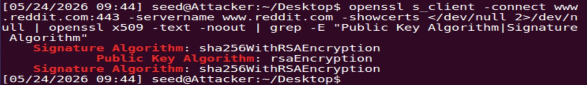

The chain was downloaded into `c0.pem` (server certificate) and `c1.pem` (issuing CA certificate):

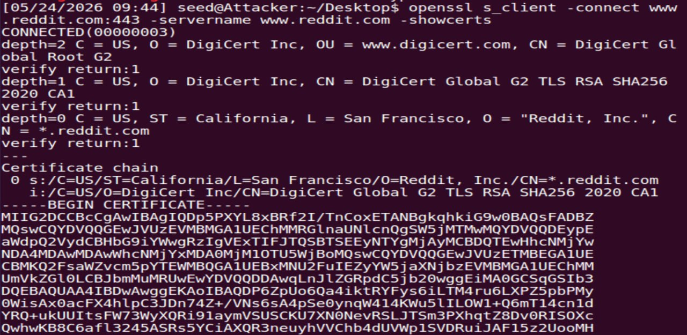

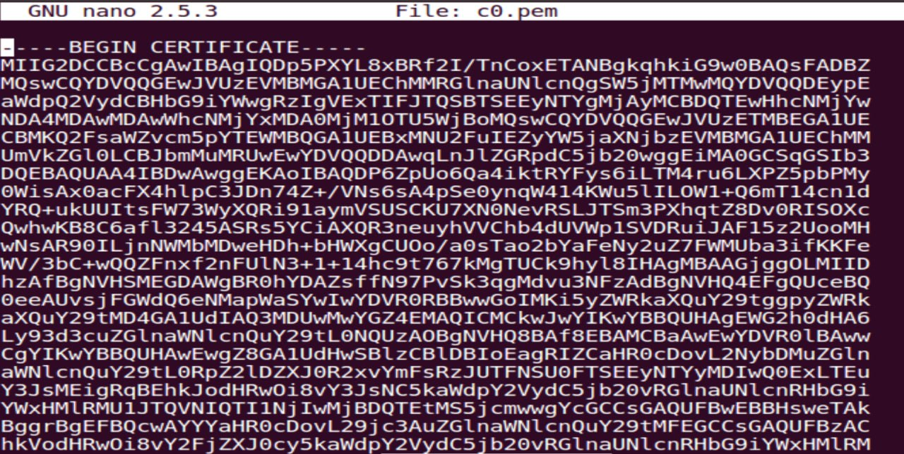

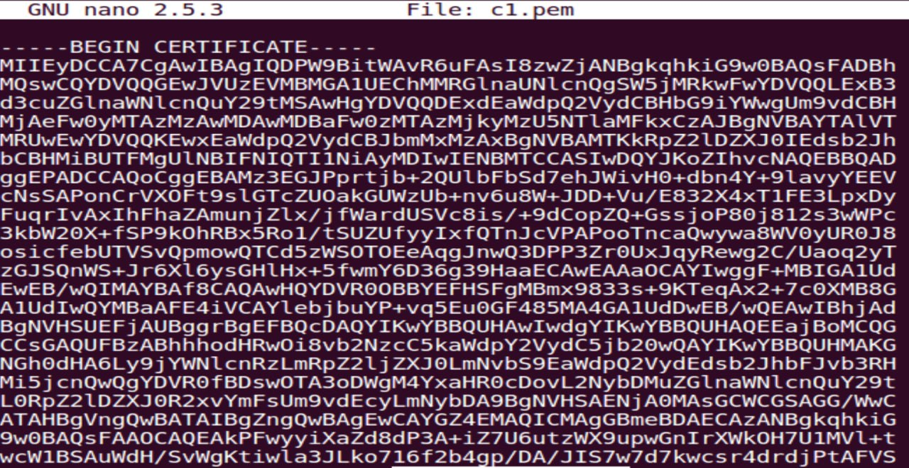

---

### Step 2 : Extract the CA public key (e, n)

The CA modulus `n` was extracted from `c1.pem`:

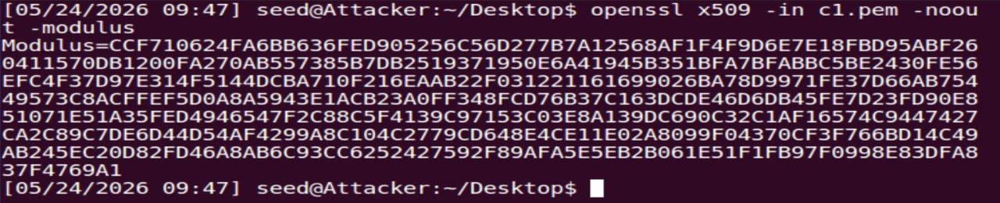

The CA exponent `e` was extracted from the same certificate:

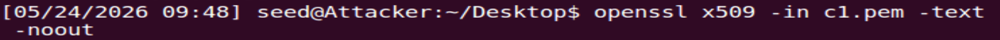

```
e = 65537 (0x10001)
```

---

### Step 3 : Extract the signature from the server certificate

The signature block from `c0.pem`:


The raw signature bytes:

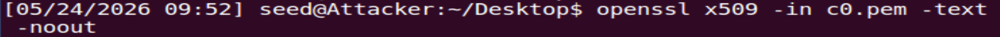

---

### Step 4 : Extract the TBS body and compute SHA-256

To produce the hash the CA actually signed, we need the bytes of the TBS (To Be Signed) section, not the whole certificate. ASN.1 parse locates its offset:

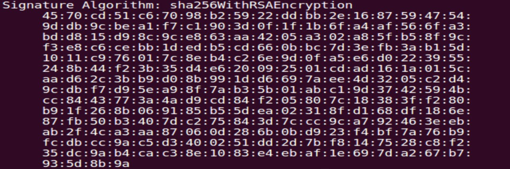

The certificate is converted to DER, the TBS is sliced out, and SHA-256 is computed:

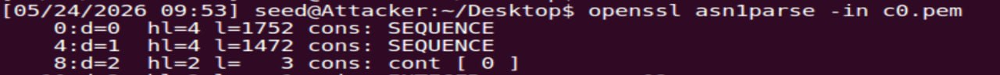

---

### Step 5 : Verify with the custom C program

`task6.c` loads the CA public key, loads the signature, computes `signature^e mod n`, and parses the resulting PKCS#1 v1.5 padded structure to extract the embedded SHA-256:

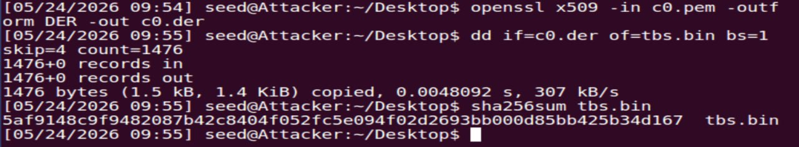

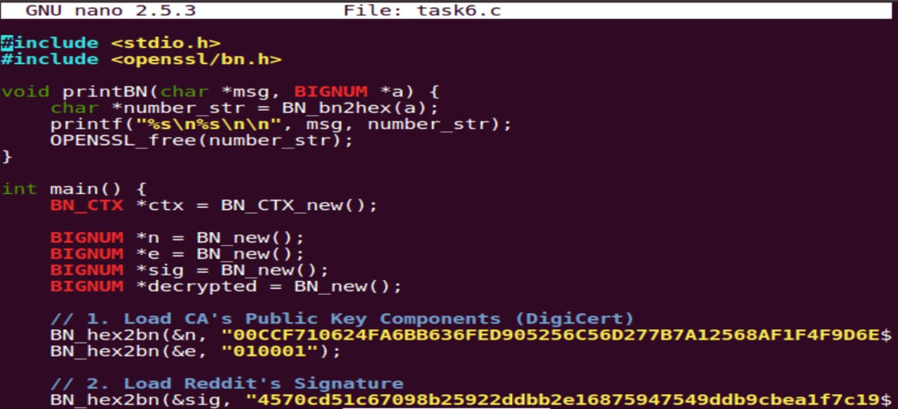

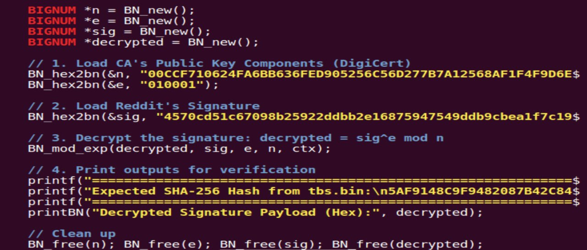

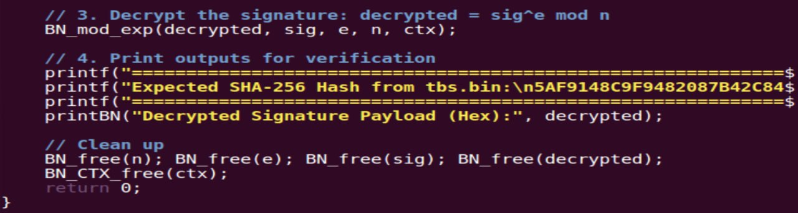

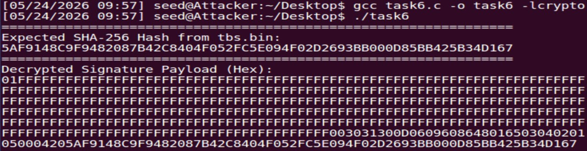

**Result:**

```
SHA-256 Hash from tbs.bin:              5AF9148C9F9482087B42C8404F052FC5E094F02D2693BB000D85BB425B34D167
Hash extracted from decrypted signature: 5AF9148C9F9482087B42C8404F052FC5E094F02D2693BB000D85BB425B34D167
==> MATCH : Certificate verified successfully!
```

### Summary

The two hashes are identical. This proves that the body of `www.reddit.com`'s certificate has not been altered since the intermediate CA signed it. The chain continues recursively: that intermediate CA's own certificate can be verified against the root, terminating at a root that browsers trust by configuration. This is the entire trust model behind HTTPS / TLS.

---

## Lab Summary

| Task | Operation | Result |
|---|---|---|
| 1 | `d = e^{:1} mod φ(n)` | Recovered `d = 3587A245...96AEB` |
| 2 | `C = M^e mod n` on `"A top secret!"` | `C = 6FB078DA...5FADC` |
| 3 | `M = C^d mod n` | `"Password is dees"` |
| 4 | Sign `M1 ($2000)` and `M2 ($3000)` | Two fully decorrelated 256 bit signatures |
| 5 | Verify valid and corrupted signatures | Valid matches, corrupted is unrecognizable |
| 6 | Manually verify `www.reddit.com` X.509 | Recovered hash equals locally computed hash |

### Core Findings

* **RSA is symmetric in its key roles.** Encryption uses `(e, n)`; signing uses `(d, n)`; both rely on the same `BN_mod_exp` primitive.
* **The avalanche effect protects integrity.** A single bit flip in either the message or the signature produces an unrelated output. There is no way to mutate a signed message into another valid signed message without `d`.
* **PKI is layered RSA verification.** The procedure executed in Task 6 is exactly what a browser does on every TLS handshake, multiplied across the chain to the root.
* **Key length is the only thing standing between RSA and break.** The Beyond Requirements section shows what happens when this number is set too small.

---

## Beyond Requirements: Factoring Attack via FactorDB

### Background

RSA's security reduces entirely to the hardness of integer factorization: if an attacker can recover `p` and `q` from `n`, they can compute `φ(n)` and therefore `d`. The lab instructions explicitly note that 256 bit moduli are not secure. This section demonstrates that empirically by factoring the public modulus from Task 1 and rederiving `d` from `(n, e)` alone.

### Objective

1. Recover `d` using only the public key `(n, e)` and a public factoring oracle (FactorDB).
2. Verify the recovered `d` matches the value produced by `BN_mod_inverse` in Task 1, byte for byte.

### Method

**Step 1 :** Query FactorDB with `n` in decimal form. Within milliseconds the service returned status `FF` (Fully Factored) along with both prime factors `p` and `q`.

**Step 2 :** A short Python script applies the extended Euclidean algorithm (`egcd` and `mod_inverse`) to compute `d` from the factored `(p, q, e)`, and then compares it to the expected `d`:

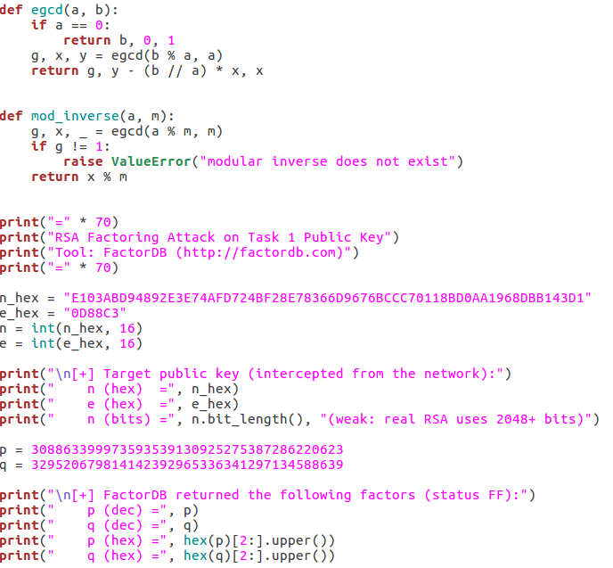

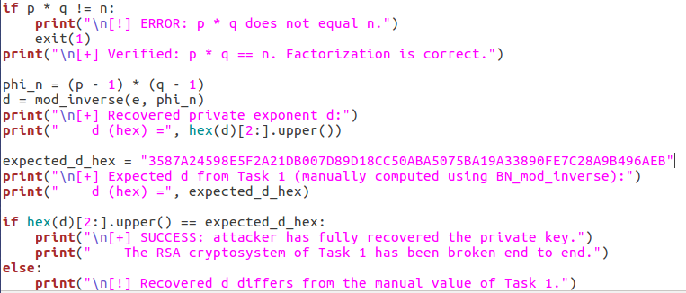

**Step 3 :** Run the script.

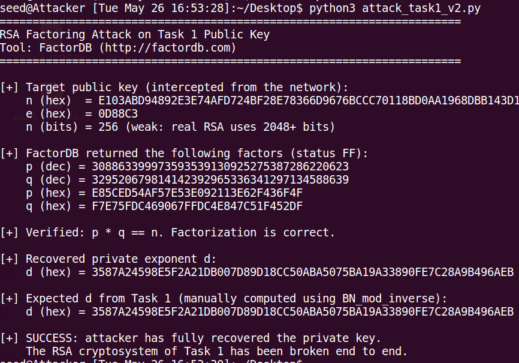

### Result

The recovered `d` is identical to the `d` produced by `BN_mod_inverse` in Task 1. The script verifies `p * q == n` and `e * d ≡ 1 (mod φ(n))` to confirm the attack succeeded mathematically, not just by coincidence.

### Lesson

A 256 bit RSA modulus falls in seconds using public infrastructure. Real deployments need 2048 bits as the floor, and NIST recommends 3072 bits for new keys with a horizon past 2030. RSA's hardness is not in the algorithm; it is entirely a function of the modulus size relative to current factoring capability.

> [!TIP]
> **Problem solved:** The local `sympy` shipped with Ubuntu 16.04 uses Pollard's Rho, which is impractically slow against 256 bit composites. FactorDB combines ECM (Elliptic Curve Method) and GNFS (General Number Field Sieve) on dedicated hardware, returning factors instantly.

---

[← Lab 4](../lab-4/README.md) | [Index](../README.md)
